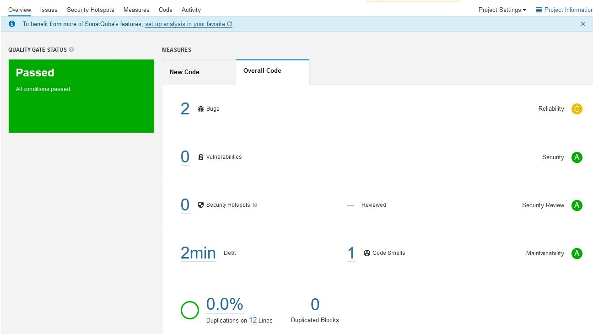
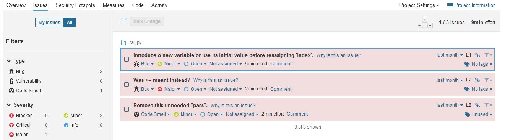
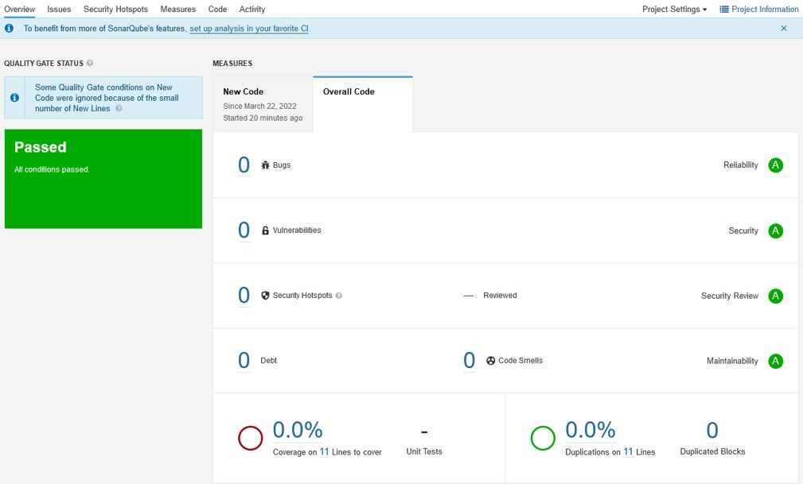
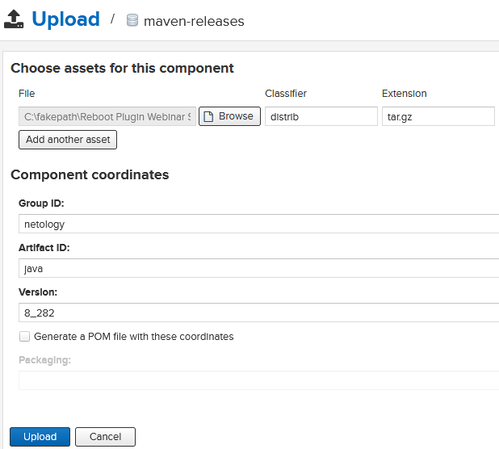
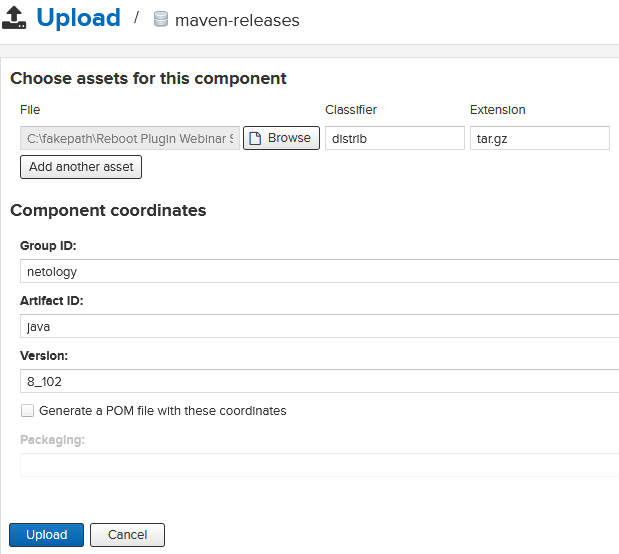

<h1>Домашнее задание к занятию "09.03 CI\CD"</h1>
<h2>Подготовка к выполнению</h2>
<ol dir="auto">
<li>Создаём 2 VM в yandex cloud со следующими параметрами: 2CPU 4RAM Centos7(остальное по минимальным требованиям)</li>
<li>Прописываем в <a href="/netology-code/mnt-homeworks/blob/MNT-7/09-ci-03-cicd/infrastructure/inventory/cicd/hosts.yml">inventory</a> <a href="/netology-code/mnt-homeworks/blob/MNT-7/09-ci-03-cicd/infrastructure/site.yml">playbook'a</a> созданные хосты</li>
<li>Добавляем в <a href="/netology-code/mnt-homeworks/blob/MNT-7/09-ci-03-cicd/infrastructure/files">files</a> файл со своим публичным ключом (id_rsa.pub). Если ключ называется иначе - найдите таску в плейбуке, которая использует id_rsa.pub имя и исправьте на своё</li>
<li>Запускаем playbook, ожидаем успешного завершения</li>
<li>Проверяем готовность Sonarqube через <a href="http://localhost:9000" rel="nofollow">браузер</a></li>
<li>Заходим под admin\admin, меняем пароль на свой</li>
<li>Проверяем готовность Nexus через <a href="http://localhost:8081" rel="nofollow">бразуер</a></li>
<li>Подключаемся под admin\admin123, меняем пароль, сохраняем анонимный доступ</li>
</ol>
<h2>Знакомоство с SonarQube</h2>
<h3>Основная часть</h3>
<ol dir="auto">
<li>Создаём новый проект, название произвольное</li>
<li>Скачиваем пакет sonar-scanner, который нам предлагает скачать сам sonarqube</li>
<li>Делаем так, чтобы binary был доступен через вызов в shell (или меняем переменную PATH или любой другой удобный вам способ)</li>
<li>Проверяем <code>sonar-scanner --version</code>

```
$ sonar-scanner --version
INFO: Scanner configuration file: /home/sergey/Downloads/sonar-scanner-4.7.0.2747-linux/conf/sonar-scanner.properties
INFO: Project root configuration file: NONE
INFO: SonarScanner 4.7.0.2747
INFO: Java 11.0.14.1 Eclipse Adoptium (64-bit)
INFO: Linux 4.19.0-18-amd64 amd64
```
</li>
<li>Запускаем анализатор против кода из директории <a href="/netology-code/mnt-homeworks/blob/MNT-7/09-ci-03-cicd/example">example</a> с дополнительным ключом <code>-Dsonar.coverage.exclusions=fail.py</code>

```
$ sonar-scanner \
ctKey=n>   -Dsonar.projectKey=netology-93 \
Dsonar.>   -Dsonar.sources=. \
sonar.h>   -Dsonar.host.url=http://51.250.67.88:9000 \
>   -Dsonar.login=27ec8b753de62e3c33489fda0469ff5faf66b071 \
>   -Dsonar.coverage.exclusions=fail.py
INFO: Scanner configuration file: /home/sergey/Downloads/sonar-scanner-4.7.0.2747-linux/conf/sonar-scanner.properties
INFO: Project root configuration file: NONE
INFO: SonarScanner 4.7.0.2747
INFO: Java 11.0.14.1 Eclipse Adoptium (64-bit)
INFO: Linux 4.19.0-18-amd64 amd64
INFO: User cache: /home/sergey/.sonar/cache
INFO: Scanner configuration file: /home/sergey/Downloads/sonar-scanner-4.7.0.2747-linux/conf/sonar-scanner.properties
INFO: Project root configuration file: NONE
INFO: Analyzing on SonarQube server 9.1.0
INFO: Default locale: "en_US", source code encoding: "UTF-8" (analysis is platform dependent)
INFO: Load global settings
INFO: Load global settings (done) | time=171ms
INFO: Server id: 9CFC3560-AX-yYc0zWmjA1HwaageJ
INFO: User cache: /home/sergey/.sonar/cache
INFO: Load/download plugins
INFO: Load plugins index
INFO: Load plugins index (done) | time=85ms
INFO: Load/download plugins (done) | time=186ms
INFO: Process project properties
INFO: Process project properties (done) | time=10ms
INFO: Execute project builders
INFO: Execute project builders (done) | time=2ms
INFO: Project key: netology-93
INFO: Base dir: /home/sergey/git/devops-netology/03-mnt-homeworks/09-ci-03-cicd/example
INFO: Working dir: /home/sergey/git/devops-netology/03-mnt-homeworks/09-ci-03-cicd/example/.scannerwork
INFO: Load project settings for component key: 'netology-93'
INFO: Load project settings for component key: 'netology-93' (done) | time=40ms
INFO: Load quality profiles
INFO: Load quality profiles (done) | time=103ms
INFO: Load active rules
INFO: Load active rules (done) | time=2407ms
INFO: Indexing files...
INFO: Project configuration:
INFO:   Excluded sources for coverage: fail.py
INFO: 1 file indexed
INFO: 0 files ignored because of scm ignore settings
INFO: Quality profile for py: Sonar way
INFO: ------------- Run sensors on module netology-93
INFO: Load metrics repository
INFO: Load metrics repository (done) | time=55ms
INFO: Sensor Python Sensor [python]
WARN: Your code is analyzed as compatible with python 2 and 3 by default. This will prevent the detection of issues specific to python 2 or python 3. You can get a more precise analysis by setting a python version in your configuration via the parameter "sonar.python.version"
INFO: Starting global symbols computation
INFO: 1 source file to be analyzed
INFO: Load project repositories
INFO: Load project repositories (done) | time=40ms
INFO: 1/1 source file has been analyzed
INFO: Starting rules execution
INFO: 1 source file to be analyzed
INFO: 1/1 source file has been analyzed
INFO: Sensor Python Sensor [python] (done) | time=955ms
INFO: Sensor Cobertura Sensor for Python coverage [python]
INFO: Sensor Cobertura Sensor for Python coverage [python] (done) | time=10ms
INFO: Sensor PythonXUnitSensor [python]
INFO: Sensor PythonXUnitSensor [python] (done) | time=1ms
INFO: Sensor CSS Rules [cssfamily]
INFO: No CSS, PHP, HTML or VueJS files are found in the project. CSS analysis is skipped.
INFO: Sensor CSS Rules [cssfamily] (done) | time=1ms
INFO: Sensor JaCoCo XML Report Importer [jacoco]
INFO: 'sonar.coverage.jacoco.xmlReportPaths' is not defined. Using default locations: target/site/jacoco/jacoco.xml,target/site/jacoco-it/jacoco.xml,build/reports/jacoco/test/jacocoTestReport.xml
INFO: No report imported, no coverage information will be imported by JaCoCo XML Report Importer
INFO: Sensor JaCoCo XML Report Importer [jacoco] (done) | time=4ms
INFO: Sensor C# Project Type Information [csharp]
INFO: Sensor C# Project Type Information [csharp] (done) | time=1ms
INFO: Sensor C# Analysis Log [csharp]
INFO: Sensor C# Analysis Log [csharp] (done) | time=17ms
INFO: Sensor C# Properties [csharp]
INFO: Sensor C# Properties [csharp] (done) | time=1ms
INFO: Sensor JavaXmlSensor [java]
INFO: Sensor JavaXmlSensor [java] (done) | time=1ms
INFO: Sensor HTML [web]
INFO: Sensor HTML [web] (done) | time=4ms
INFO: Sensor VB.NET Project Type Information [vbnet]
INFO: Sensor VB.NET Project Type Information [vbnet] (done) | time=1ms
INFO: Sensor VB.NET Analysis Log [vbnet]
INFO: Sensor VB.NET Analysis Log [vbnet] (done) | time=17ms
INFO: Sensor VB.NET Properties [vbnet]
INFO: Sensor VB.NET Properties [vbnet] (done) | time=1ms
INFO: ------------- Run sensors on project
INFO: Sensor Zero Coverage Sensor
INFO: Sensor Zero Coverage Sensor (done) | time=0ms
INFO: SCM Publisher SCM provider for this project is: git
INFO: SCM Publisher 1 source file to be analyzed
INFO: SCM Publisher 1/1 source file have been analyzed (done) | time=230ms
INFO: CPD Executor Calculating CPD for 1 file
INFO: CPD Executor CPD calculation finished (done) | time=9ms
INFO: Analysis report generated in 104ms, dir size=103.1 kB
INFO: Analysis report compressed in 46ms, zip size=14.3 kB
INFO: Analysis report uploaded in 74ms
INFO: ANALYSIS SUCCESSFUL, you can browse http://51.250.67.88:9000/dashboard?id=netology-93
INFO: Note that you will be able to access the updated dashboard once the server has processed the submitted analysis report
INFO: More about the report processing at http://51.250.67.88:9000/api/ce/task?id=AX-yv5jPWmjA1Hwaaljl
INFO: Analysis total time: 6.525 s
INFO: ------------------------------------------------------------------------
INFO: EXECUTION SUCCESS
INFO: ------------------------------------------------------------------------
INFO: Total time: 8.165s
INFO: Final Memory: 8M/30M
INFO: ------------------------------------------------------------------------

```
</li>
<li>Смотрим результат в интерфейсе



</li>

<li>Исправляем ошибки, которые он выявил(включая warnings)

```
def increment(param):
   param += 1
   return param
def get_square(numb):
   return numb*numb
def print_numb(numb):
   print("Number is {}".format(numb))

index = 0
while (index < 10):
   index = increment(index)
   print(get_square(index))
```
</li>
<li>Запускаем анализатор повторно - проверяем, что QG пройдены успешно</li>
<li>Делаем скриншот успешного прохождения анализа, прикладываем к решению ДЗ


</li>
</ol>
<h2>Знакомство с Nexus</h2>
<h3>Основная часть</h3>
<ol dir="auto">
<li>В репозиторий <code>maven-public</code> загружаем артефакт с GAV параметрами:
<ol dir="auto">
<li>groupId: netology</li>
<li>artifactId: java</li>
<li>version: 8_282</li>
<li>classifier: distrib</li>
<li>type: tar.gz</li>


</ol>
</li>
<li>В него же загружаем такой же артефакт, но с version: 8_102</li>


<li>Проверяем, что все файлы загрузились успешно</li>
<li>В ответе присылаем файл <code>maven-metadata.xml</code> для этого артефекта</li>
<a href=files/maven-metadata.xml>maven-metadata.xml</a>
</ol>
<h3>Знакомство с Maven</h3>
<h3>Подготовка к выполнению</h3>
<ol dir="auto">
<li>Скачиваем дистрибутив с <a href="https://maven.apache.org/download.cgi" rel="nofollow">maven</a></li>
<li>Разархивируем, делаем так, чтобы binary был доступен через вызов в shell (или меняем переменную PATH или любой другой удобный вам способ)</li>
<li>Удаляем из <code>apache-maven-&lt;version&gt;/conf/settings.xml</code> упоминание о правиле, отвергающем http соединение( раздел mirrors-&gt;id: my-repository-http-unblocker)</li>
<li>Проверяем <code>mvn --version</code></li>

```
$ mvn --version
Apache Maven 3.8.5 (3599d3414f046de2324203b78ddcf9b5e4388aa0)
Maven home: /home/sergey/Downloads/apache-maven-3.8.5
Java version: 17.0.2, vendor: Oracle Corporation, runtime: /usr/lib/jvm/jdk-17
Default locale: en_US, platform encoding: UTF-8
OS name: "linux", version: "4.19.0-18-amd64", arch: "amd64", family: "unix"
```
<li>Забираем директорию <a href="/netology-code/mnt-homeworks/blob/MNT-7/09-ci-03-cicd/mvn">mvn</a> с pom</li>
</ol>
<h3>Основная часть</h3>
<ol dir="auto">
<li>Меняем в <code>pom.xml</code> блок с зависимостями под наш артефакт из первого пункта задания для Nexus (java с версией 8_282)

```
<project xmlns="http://maven.apache.org/POM/4.0.0" xmlns:xsi="http://www.w3.org/2001/XMLSchema-instance"
xsi:schemaLocation="http://maven.apache.org/POM/4.0.0 http://maven.apache.org/xsd/maven-4.0.0.xsd">
<modelVersion>4.0.0</modelVersion>

<groupId>com.netology.app</groupId>
<artifactId>simple-app</artifactId>
<version>1.0-SNAPSHOT</version>
   <repositories>
   <repository>
      <id>my-repo</id>
      <name>maven-public</name>
      <url>http://51.250.65.34:8081/repository/maven-public/</url>
   </repository>
</repositories>
<dependencies>
   <dependency>
      <groupId>netology</groupId>
      <artifactId>java</artifactId>
      <version>8_282</version>
      <classifier>distrib</classifier>
      <type>tar.gz</type>
   </dependency>
</dependencies>
</project>
```
</li>
<li>Запускаем команду <code>mvn package</code> в директории с <code>pom.xml</code>, ожидаем успешного окончания

```
$ mvn package
[INFO] Scanning for projects...
[INFO]
[INFO] --------------------< com.netology.app:simple-app >---------------------
[INFO] Building simple-app 1.0-SNAPSHOT
[INFO] --------------------------------[ jar ]---------------------------------
Downloading from central: https://repo.maven.apache.org/maven2/org/apache/maven/plugins/maven-resources-plugin/2.6/maven-resources-plugin-2.6.pom
Downloaded from central: https://repo.maven.apache.org/maven2/org/apache/maven/plugins/maven-resources-plugin/2.6/maven-resources-plugin-2.6.pom (8.1 kB at 12 kB/s)
Downloading from central: https://repo.maven.apache.org/maven2/org/apache/maven/plugins/maven-plugins/23/maven-plugins-23.pom
Downloaded from central: https://repo.maven.apache.org/maven2/org/apache/maven/plugins/maven-plugins/23/maven-plugins-23.pom (9.2 kB at 63 kB/s)
Downloading from central: https://repo.maven.apache.org/maven2/org/apache/maven/maven-parent/22/maven-parent-22.pom
Downloaded from central: https://repo.maven.apache.org/maven2/org/apache/maven/maven-parent/22/maven-parent-22.pom (30 kB at 180 kB/s)
Downloading from central: https://repo.maven.apache.org/maven2/org/apache/apache/11/apache-11.pom
Downloaded from central: https://repo.maven.apache.org/maven2/org/apache/apache/11/apache-11.pom (15 kB at 104 kB/s)
Downloading from central: https://repo.maven.apache.org/maven2/org/apache/maven/plugins/maven-resources-plugin/2.6/maven-resources-plugin-2.6.jar
Downloaded from central: https://repo.maven.apache.org/maven2/org/apache/maven/plugins/maven-resources-plugin/2.6/maven-resources-plugin-2.6.jar (30 kB at 189 kB/s)
Downloading from central: https://repo.maven.apache.org/maven2/org/apache/maven/plugins/maven-compiler-plugin/3.1/maven-compiler-plugin-3.1.pom
Downloaded from central: https://repo.maven.apache.org/maven2/org/apache/maven/plugins/maven-compiler-plugin/3.1/maven-compiler-plugin-3.1.pom (10 kB at 73 kB/s)
Downloading from central: https://repo.maven.apache.org/maven2/org/apache/maven/plugins/maven-plugins/24/maven-plugins-24.pom
Downloaded from central: https://repo.maven.apache.org/maven2/org/apache/maven/plugins/maven-plugins/24/maven-plugins-24.pom (11 kB at 75 kB/s)
Downloading from central: https://repo.maven.apache.org/maven2/org/apache/maven/maven-parent/23/maven-parent-23.pom
Downloaded from central: https://repo.maven.apache.org/maven2/org/apache/maven/maven-parent/23/maven-parent-23.pom (33 kB at 212 kB/s)
Downloading from central: https://repo.maven.apache.org/maven2/org/apache/apache/13/apache-13.pom
Downloaded from central: https://repo.maven.apache.org/maven2/org/apache/apache/13/apache-13.pom (14 kB at 97 kB/s)
Downloading from central: https://repo.maven.apache.org/maven2/org/apache/maven/plugins/maven-compiler-plugin/3.1/maven-compiler-plugin-3.1.jar
Downloaded from central: https://repo.maven.apache.org/maven2/org/apache/maven/plugins/maven-compiler-plugin/3.1/maven-compiler-plugin-3.1.jar (43 kB at 274 kB/s)
Downloading from central: https://repo.maven.apache.org/maven2/org/apache/maven/plugins/maven-surefire-plugin/2.12.4/maven-surefire-plugin-2.12.4.pom
Downloaded from central: https://repo.maven.apache.org/maven2/org/apache/maven/plugins/maven-surefire-plugin/2.12.4/maven-surefire-plugin-2.12.4.pom (10 kB at 77 kB/s)
Downloading from central: https://repo.maven.apache.org/maven2/org/apache/maven/surefire/surefire/2.12.4/surefire-2.12.4.pom
Downloaded from central: https://repo.maven.apache.org/maven2/org/apache/maven/surefire/surefire/2.12.4/surefire-2.12.4.pom (14 kB at 98 kB/s)
Downloading from central: https://repo.maven.apache.org/maven2/org/apache/maven/plugins/maven-surefire-plugin/2.12.4/maven-surefire-plugin-2.12.4.jar
Downloaded from central: https://repo.maven.apache.org/maven2/org/apache/maven/plugins/maven-surefire-plugin/2.12.4/maven-surefire-plugin-2.12.4.jar (30 kB at 210 kB/s)
Downloading from central: https://repo.maven.apache.org/maven2/org/apache/maven/plugins/maven-jar-plugin/2.4/maven-jar-plugin-2.4.pom
Downloaded from central: https://repo.maven.apache.org/maven2/org/apache/maven/plugins/maven-jar-plugin/2.4/maven-jar-plugin-2.4.pom (5.8 kB at 44 kB/s)
Downloading from central: https://repo.maven.apache.org/maven2/org/apache/maven/plugins/maven-plugins/22/maven-plugins-22.pom
Downloaded from central: https://repo.maven.apache.org/maven2/org/apache/maven/plugins/maven-plugins/22/maven-plugins-22.pom (13 kB at 95 kB/s)
Downloading from central: https://repo.maven.apache.org/maven2/org/apache/maven/maven-parent/21/maven-parent-21.pom
Downloaded from central: https://repo.maven.apache.org/maven2/org/apache/maven/maven-parent/21/maven-parent-21.pom (26 kB at 182 kB/s)
Downloading from central: https://repo.maven.apache.org/maven2/org/apache/apache/10/apache-10.pom
Downloaded from central: https://repo.maven.apache.org/maven2/org/apache/apache/10/apache-10.pom (15 kB at 107 kB/s)
Downloading from central: https://repo.maven.apache.org/maven2/org/apache/maven/plugins/maven-jar-plugin/2.4/maven-jar-plugin-2.4.jar
Downloaded from central: https://repo.maven.apache.org/maven2/org/apache/maven/plugins/maven-jar-plugin/2.4/maven-jar-plugin-2.4.jar (34 kB at 230 kB/s)
Downloading from my-repo: http://51.250.65.34:8081/repository/maven-public/netology/java/8_282/java-8_282.pom
Downloading from central: https://repo.maven.apache.org/maven2/netology/java/8_282/java-8_282.pom
[WARNING] The POM for netology:java:tar.gz:distrib:8_282 is missing, no dependency information available
Downloading from my-repo: http://51.250.65.34:8081/repository/maven-public/netology/java/8_282/java-8_282-distrib.tar.gz
Downloaded from my-repo: http://51.250.65.34:8081/repository/maven-public/netology/java/8_282/java-8_282-distrib.tar.gz (281 kB at 1.4 MB/s)
[INFO]
[INFO] --- maven-resources-plugin:2.6:resources (default-resources) @ simple-app ---
Downloading from central: https://repo.maven.apache.org/maven2/org/apache/maven/maven-plugin-api/2.0.6/maven-plugin-api-2.0.6.pom
Downloaded from central: https://repo.maven.apache.org/maven2/org/apache/maven/maven-plugin-api/2.0.6/maven-plugin-api-2.0.6.pom (1.5 kB at 11 kB/s)
Downloading from central: https://repo.maven.apache.org/maven2/org/apache/maven/maven/2.0.6/maven-2.0.6.pom
Downloaded from central: https://repo.maven.apache.org/maven2/org/apache/maven/maven/2.0.6/maven-2.0.6.pom (9.0 kB at 67 kB/s)
Downloading from central: https://repo.maven.apache.org/maven2/org/apache/maven/maven-parent/5/maven-parent-5.pom
Downloaded from central: https://repo.maven.apache.org/maven2/org/apache/maven/maven-parent/5/maven-parent-5.pom (15 kB at 110 kB/s)
Downloading from central: https://repo.maven.apache.org/maven2/org/apache/apache/3/apache-3.pom
Downloaded from central: https://repo.maven.apache.org/maven2/org/apache/apache/3/apache-3.pom (3.4 kB at 26 kB/s)
Downloading from central: https://repo.maven.apache.org/maven2/org/apache/maven/maven-project/2.0.6/maven-project-2.0.6.pom
Downloaded from central: https://repo.maven.apache.org/maven2/org/apache/maven/maven-project/2.0.6/maven-project-2.0.6.pom (2.6 kB at 20 kB/s)
Downloading from central: https://repo.maven.apache.org/maven2/org/apache/maven/maven-settings/2.0.6/maven-settings-2.0.6.pom
Downloaded from central: https://repo.maven.apache.org/maven2/org/apache/maven/maven-settings/2.0.6/maven-settings-2.0.6.pom (2.0 kB at 15 kB/s)
Downloading from central: https://repo.maven.apache.org/maven2/org/apache/maven/maven-model/2.0.6/maven-model-2.0.6.pom
Downloaded from central: https://repo.maven.apache.org/maven2/org/apache/maven/maven-model/2.0.6/maven-model-2.0.6.pom (3.0 kB at 23 kB/s)
Downloading from central: https://repo.maven.apache.org/maven2/org/codehaus/plexus/plexus-utils/1.4.1/plexus-utils-1.4.1.pom
Downloaded from central: https://repo.maven.apache.org/maven2/org/codehaus/plexus/plexus-utils/1.4.1/plexus-utils-1.4.1.pom (1.9 kB at 14 kB/s)
Downloading from central: https://repo.maven.apache.org/maven2/org/codehaus/plexus/plexus/1.0.11/plexus-1.0.11.pom
Downloaded from central: https://repo.maven.apache.org/maven2/org/codehaus/plexus/plexus/1.0.11/plexus-1.0.11.pom (9.0 kB at 66 kB/s)
Downloading from central: https://repo.maven.apache.org/maven2/org/codehaus/plexus/plexus-container-default/1.0-alpha-9-stable-1/plexus-container-default-1.0-alpha-9-stable-1.pom
Downloaded from central: https://repo.maven.apache.org/maven2/org/codehaus/plexus/plexus-container-default/1.0-alpha-9-stable-1/plexus-container-default-1.0-alpha-9-stable-1.pom (3.9 kB at 27 kB/s)
Downloading from central: https://repo.maven.apache.org/maven2/org/codehaus/plexus/plexus-containers/1.0.3/plexus-containers-1.0.3.pom
Downloaded from central: https://repo.maven.apache.org/maven2/org/codehaus/plexus/plexus-containers/1.0.3/plexus-containers-1.0.3.pom (492 B at 3.7 kB/s)
Downloading from central: https://repo.maven.apache.org/maven2/org/codehaus/plexus/plexus/1.0.4/plexus-1.0.4.pom
Downloaded from central: https://repo.maven.apache.org/maven2/org/codehaus/plexus/plexus/1.0.4/plexus-1.0.4.pom (5.7 kB at 42 kB/s)
Downloading from central: https://repo.maven.apache.org/maven2/junit/junit/3.8.1/junit-3.8.1.pom
Downloaded from central: https://repo.maven.apache.org/maven2/junit/junit/3.8.1/junit-3.8.1.pom (998 B at 7.5 kB/s)
Downloading from central: https://repo.maven.apache.org/maven2/org/codehaus/plexus/plexus-utils/1.0.4/plexus-utils-1.0.4.pom
Downloaded from central: https://repo.maven.apache.org/maven2/org/codehaus/plexus/plexus-utils/1.0.4/plexus-utils-1.0.4.pom (6.9 kB at 51 kB/s)
Downloading from central: https://repo.maven.apache.org/maven2/classworlds/classworlds/1.1-alpha-2/classworlds-1.1-alpha-2.pom
Downloaded from central: https://repo.maven.apache.org/maven2/classworlds/classworlds/1.1-alpha-2/classworlds-1.1-alpha-2.pom (3.1 kB at 24 kB/s)
Downloading from central: https://repo.maven.apache.org/maven2/org/apache/maven/maven-profile/2.0.6/maven-profile-2.0.6.pom
Downloaded from central: https://repo.maven.apache.org/maven2/org/apache/maven/maven-profile/2.0.6/maven-profile-2.0.6.pom (2.0 kB at 15 kB/s)
Downloading from central: https://repo.maven.apache.org/maven2/org/apache/maven/maven-artifact-manager/2.0.6/maven-artifact-manager-2.0.6.pom
Downloaded from central: https://repo.maven.apache.org/maven2/org/apache/maven/maven-artifact-manager/2.0.6/maven-artifact-manager-2.0.6.pom (2.6 kB at 20 kB/s)
Downloading from central: https://repo.maven.apache.org/maven2/org/apache/maven/maven-repository-metadata/2.0.6/maven-repository-metadata-2.0.6.pom
Downloaded from central: https://repo.maven.apache.org/maven2/org/apache/maven/maven-repository-metadata/2.0.6/maven-repository-metadata-2.0.6.pom (1.9 kB at 13 kB/s)
Downloading from central: https://repo.maven.apache.org/maven2/org/apache/maven/maven-artifact/2.0.6/maven-artifact-2.0.6.pom
Downloaded from central: https://repo.maven.apache.org/maven2/org/apache/maven/maven-artifact/2.0.6/maven-artifact-2.0.6.pom (1.6 kB at 9.9 kB/s)
Downloading from central: https://repo.maven.apache.org/maven2/org/apache/maven/maven-plugin-registry/2.0.6/maven-plugin-registry-2.0.6.pom
Downloaded from central: https://repo.maven.apache.org/maven2/org/apache/maven/maven-plugin-registry/2.0.6/maven-plugin-registry-2.0.6.pom (1.9 kB at 15 kB/s)
Downloading from central: https://repo.maven.apache.org/maven2/org/apache/maven/maven-core/2.0.6/maven-core-2.0.6.pom
Downloaded from central: https://repo.maven.apache.org/maven2/org/apache/maven/maven-core/2.0.6/maven-core-2.0.6.pom (6.7 kB at 50 kB/s)
Downloading from central: https://repo.maven.apache.org/maven2/org/apache/maven/maven-plugin-parameter-documenter/2.0.6/maven-plugin-parameter-documenter-2.0.6.pom
Downloaded from central: https://repo.maven.apache.org/maven2/org/apache/maven/maven-plugin-parameter-documenter/2.0.6/maven-plugin-parameter-documenter-2.0.6.pom (1.9 kB at 14 kB/s)
Downloading from central: https://repo.maven.apache.org/maven2/org/apache/maven/reporting/maven-reporting-api/2.0.6/maven-reporting-api-2.0.6.pom
Downloaded from central: https://repo.maven.apache.org/maven2/org/apache/maven/reporting/maven-reporting-api/2.0.6/maven-reporting-api-2.0.6.pom (1.8 kB at 13 kB/s)
Downloading from central: https://repo.maven.apache.org/maven2/org/apache/maven/reporting/maven-reporting/2.0.6/maven-reporting-2.0.6.pom
Downloaded from central: https://repo.maven.apache.org/maven2/org/apache/maven/reporting/maven-reporting/2.0.6/maven-reporting-2.0.6.pom (1.4 kB at 11 kB/s)
Downloading from central: https://repo.maven.apache.org/maven2/org/apache/maven/doxia/doxia-sink-api/1.0-alpha-7/doxia-sink-api-1.0-alpha-7.pom
Downloaded from central: https://repo.maven.apache.org/maven2/org/apache/maven/doxia/doxia-sink-api/1.0-alpha-7/doxia-sink-api-1.0-alpha-7.pom (424 B at 3.1 kB/s)
Downloading from central: https://repo.maven.apache.org/maven2/org/apache/maven/doxia/doxia/1.0-alpha-7/doxia-1.0-alpha-7.pom
Downloaded from central: https://repo.maven.apache.org/maven2/org/apache/maven/doxia/doxia/1.0-alpha-7/doxia-1.0-alpha-7.pom (3.9 kB at 30 kB/s)
Downloading from central: https://repo.maven.apache.org/maven2/org/apache/maven/maven-error-diagnostics/2.0.6/maven-error-diagnostics-2.0.6.pom
Downloaded from central: https://repo.maven.apache.org/maven2/org/apache/maven/maven-error-diagnostics/2.0.6/maven-error-diagnostics-2.0.6.pom (1.7 kB at 13 kB/s)
Downloading from central: https://repo.maven.apache.org/maven2/commons-cli/commons-cli/1.0/commons-cli-1.0.pom
Downloaded from central: https://repo.maven.apache.org/maven2/commons-cli/commons-cli/1.0/commons-cli-1.0.pom (2.1 kB at 16 kB/s)
Downloading from central: https://repo.maven.apache.org/maven2/org/apache/maven/maven-plugin-descriptor/2.0.6/maven-plugin-descriptor-2.0.6.pom
Downloaded from central: https://repo.maven.apache.org/maven2/org/apache/maven/maven-plugin-descriptor/2.0.6/maven-plugin-descriptor-2.0.6.pom (2.0 kB at 15 kB/s)
Downloading from central: https://repo.maven.apache.org/maven2/org/codehaus/plexus/plexus-interactivity-api/1.0-alpha-4/plexus-interactivity-api-1.0-alpha-4.pom
Downloaded from central: https://repo.maven.apache.org/maven2/org/codehaus/plexus/plexus-interactivity-api/1.0-alpha-4/plexus-interactivity-api-1.0-alpha-4.pom (7.1 kB at 52 kB/s)
Downloading from central: https://repo.maven.apache.org/maven2/org/apache/maven/maven-monitor/2.0.6/maven-monitor-2.0.6.pom
Downloaded from central: https://repo.maven.apache.org/maven2/org/apache/maven/maven-monitor/2.0.6/maven-monitor-2.0.6.pom (1.3 kB at 7.3 kB/s)
Downloading from central: https://repo.maven.apache.org/maven2/classworlds/classworlds/1.1/classworlds-1.1.pom
Downloaded from central: https://repo.maven.apache.org/maven2/classworlds/classworlds/1.1/classworlds-1.1.pom (3.3 kB at 24 kB/s)
Downloading from central: https://repo.maven.apache.org/maven2/org/codehaus/plexus/plexus-utils/2.0.5/plexus-utils-2.0.5.pom
Downloaded from central: https://repo.maven.apache.org/maven2/org/codehaus/plexus/plexus-utils/2.0.5/plexus-utils-2.0.5.pom (3.3 kB at 25 kB/s)
Downloading from central: https://repo.maven.apache.org/maven2/org/codehaus/plexus/plexus/2.0.6/plexus-2.0.6.pom
Downloaded from central: https://repo.maven.apache.org/maven2/org/codehaus/plexus/plexus/2.0.6/plexus-2.0.6.pom (17 kB at 120 kB/s)
Downloading from central: https://repo.maven.apache.org/maven2/org/apache/maven/shared/maven-filtering/1.1/maven-filtering-1.1.pom
Downloaded from central: https://repo.maven.apache.org/maven2/org/apache/maven/shared/maven-filtering/1.1/maven-filtering-1.1.pom (5.8 kB at 43 kB/s)
Downloading from central: https://repo.maven.apache.org/maven2/org/apache/maven/shared/maven-shared-components/17/maven-shared-components-17.pom
Downloaded from central: https://repo.maven.apache.org/maven2/org/apache/maven/shared/maven-shared-components/17/maven-shared-components-17.pom (8.7 kB at 65 kB/s)
Downloading from central: https://repo.maven.apache.org/maven2/org/codehaus/plexus/plexus-utils/1.5.15/plexus-utils-1.5.15.pom
Downloaded from central: https://repo.maven.apache.org/maven2/org/codehaus/plexus/plexus-utils/1.5.15/plexus-utils-1.5.15.pom (6.8 kB at 51 kB/s)
Downloading from central: https://repo.maven.apache.org/maven2/org/codehaus/plexus/plexus/2.0.2/plexus-2.0.2.pom
Downloaded from central: https://repo.maven.apache.org/maven2/org/codehaus/plexus/plexus/2.0.2/plexus-2.0.2.pom (12 kB at 85 kB/s)
Downloading from central: https://repo.maven.apache.org/maven2/org/codehaus/plexus/plexus-interpolation/1.12/plexus-interpolation-1.12.pom
Downloaded from central: https://repo.maven.apache.org/maven2/org/codehaus/plexus/plexus-interpolation/1.12/plexus-interpolation-1.12.pom (889 B at 6.7 kB/s)
Downloading from central: https://repo.maven.apache.org/maven2/org/codehaus/plexus/plexus-components/1.1.14/plexus-components-1.1.14.pom
Downloaded from central: https://repo.maven.apache.org/maven2/org/codehaus/plexus/plexus-components/1.1.14/plexus-components-1.1.14.pom (5.8 kB at 44 kB/s)
Downloading from central: https://repo.maven.apache.org/maven2/org/sonatype/plexus/plexus-build-api/0.0.4/plexus-build-api-0.0.4.pom
Downloaded from central: https://repo.maven.apache.org/maven2/org/sonatype/plexus/plexus-build-api/0.0.4/plexus-build-api-0.0.4.pom (2.9 kB at 22 kB/s)
Downloading from central: https://repo.maven.apache.org/maven2/org/sonatype/spice/spice-parent/10/spice-parent-10.pom
Downloaded from central: https://repo.maven.apache.org/maven2/org/sonatype/spice/spice-parent/10/spice-parent-10.pom (3.0 kB at 23 kB/s)
Downloading from central: https://repo.maven.apache.org/maven2/org/sonatype/forge/forge-parent/3/forge-parent-3.pom
Downloaded from central: https://repo.maven.apache.org/maven2/org/sonatype/forge/forge-parent/3/forge-parent-3.pom (5.0 kB at 38 kB/s)
Downloading from central: https://repo.maven.apache.org/maven2/org/codehaus/plexus/plexus-utils/1.5.8/plexus-utils-1.5.8.pom
Downloaded from central: https://repo.maven.apache.org/maven2/org/codehaus/plexus/plexus-utils/1.5.8/plexus-utils-1.5.8.pom (8.1 kB at 60 kB/s)
Downloading from central: https://repo.maven.apache.org/maven2/org/codehaus/plexus/plexus-interpolation/1.13/plexus-interpolation-1.13.pom
Downloaded from central: https://repo.maven.apache.org/maven2/org/codehaus/plexus/plexus-interpolation/1.13/plexus-interpolation-1.13.pom (890 B at 6.7 kB/s)
Downloading from central: https://repo.maven.apache.org/maven2/org/codehaus/plexus/plexus-components/1.1.15/plexus-components-1.1.15.pom
Downloaded from central: https://repo.maven.apache.org/maven2/org/codehaus/plexus/plexus-components/1.1.15/plexus-components-1.1.15.pom (2.8 kB at 21 kB/s)
Downloading from central: https://repo.maven.apache.org/maven2/org/codehaus/plexus/plexus/2.0.3/plexus-2.0.3.pom
Downloaded from central: https://repo.maven.apache.org/maven2/org/codehaus/plexus/plexus/2.0.3/plexus-2.0.3.pom (15 kB at 112 kB/s)
Downloading from central: https://repo.maven.apache.org/maven2/org/apache/maven/maven-plugin-api/2.0.6/maven-plugin-api-2.0.6.jar
Downloading from central: https://repo.maven.apache.org/maven2/org/apache/maven/maven-project/2.0.6/maven-project-2.0.6.jar
Downloading from central: https://repo.maven.apache.org/maven2/org/apache/maven/maven-profile/2.0.6/maven-profile-2.0.6.jar
Downloading from central: https://repo.maven.apache.org/maven2/org/apache/maven/maven-artifact-manager/2.0.6/maven-artifact-manager-2.0.6.jar
Downloading from central: https://repo.maven.apache.org/maven2/org/apache/maven/maven-plugin-registry/2.0.6/maven-plugin-registry-2.0.6.jar
Downloaded from central: https://repo.maven.apache.org/maven2/org/apache/maven/maven-project/2.0.6/maven-project-2.0.6.jar (116 kB at 567 kB/s)
Downloading from central: https://repo.maven.apache.org/maven2/org/apache/maven/maven-core/2.0.6/maven-core-2.0.6.jar
Downloaded from central: https://repo.maven.apache.org/maven2/org/apache/maven/maven-plugin-api/2.0.6/maven-plugin-api-2.0.6.jar (13 kB at 43 kB/s)
Downloading from central: https://repo.maven.apache.org/maven2/org/apache/maven/maven-plugin-parameter-documenter/2.0.6/maven-plugin-parameter-documenter-2.0.6.jar
Downloaded from central: https://repo.maven.apache.org/maven2/org/apache/maven/maven-plugin-registry/2.0.6/maven-plugin-registry-2.0.6.jar (29 kB at 95 kB/s)
Downloading from central: https://repo.maven.apache.org/maven2/org/apache/maven/reporting/maven-reporting-api/2.0.6/maven-reporting-api-2.0.6.jar
Downloaded from central: https://repo.maven.apache.org/maven2/org/apache/maven/maven-profile/2.0.6/maven-profile-2.0.6.jar (35 kB at 103 kB/s)
Downloading from central: https://repo.maven.apache.org/maven2/org/apache/maven/doxia/doxia-sink-api/1.0-alpha-7/doxia-sink-api-1.0-alpha-7.jar
Downloaded from central: https://repo.maven.apache.org/maven2/org/apache/maven/maven-core/2.0.6/maven-core-2.0.6.jar (152 kB at 419 kB/s)
Downloading from central: https://repo.maven.apache.org/maven2/org/apache/maven/maven-repository-metadata/2.0.6/maven-repository-metadata-2.0.6.jar
Downloaded from central: https://repo.maven.apache.org/maven2/org/apache/maven/maven-artifact-manager/2.0.6/maven-artifact-manager-2.0.6.jar (57 kB at 151 kB/s)
Downloading from central: https://repo.maven.apache.org/maven2/org/apache/maven/maven-error-diagnostics/2.0.6/maven-error-diagnostics-2.0.6.jar
Downloaded from central: https://repo.maven.apache.org/maven2/org/apache/maven/maven-plugin-parameter-documenter/2.0.6/maven-plugin-parameter-documenter-2.0.6.jar (21 kB at 48 kB/s)
Downloading from central: https://repo.maven.apache.org/maven2/commons-cli/commons-cli/1.0/commons-cli-1.0.jar
Downloaded from central: https://repo.maven.apache.org/maven2/org/apache/maven/reporting/maven-reporting-api/2.0.6/maven-reporting-api-2.0.6.jar (9.9 kB at 22 kB/s)
Downloading from central: https://repo.maven.apache.org/maven2/org/apache/maven/maven-plugin-descriptor/2.0.6/maven-plugin-descriptor-2.0.6.jar
Downloaded from central: https://repo.maven.apache.org/maven2/org/apache/maven/doxia/doxia-sink-api/1.0-alpha-7/doxia-sink-api-1.0-alpha-7.jar (5.9 kB at 12 kB/s)
Downloading from central: https://repo.maven.apache.org/maven2/org/codehaus/plexus/plexus-interactivity-api/1.0-alpha-4/plexus-interactivity-api-1.0-alpha-4.jar
Downloaded from central: https://repo.maven.apache.org/maven2/org/apache/maven/maven-repository-metadata/2.0.6/maven-repository-metadata-2.0.6.jar (24 kB at 48 kB/s)
Downloading from central: https://repo.maven.apache.org/maven2/classworlds/classworlds/1.1/classworlds-1.1.jar
Downloaded from central: https://repo.maven.apache.org/maven2/org/apache/maven/maven-error-diagnostics/2.0.6/maven-error-diagnostics-2.0.6.jar (14 kB at 26 kB/s)
Downloading from central: https://repo.maven.apache.org/maven2/org/apache/maven/maven-artifact/2.0.6/maven-artifact-2.0.6.jar
Downloaded from central: https://repo.maven.apache.org/maven2/commons-cli/commons-cli/1.0/commons-cli-1.0.jar (30 kB at 53 kB/s)
Downloading from central: https://repo.maven.apache.org/maven2/org/apache/maven/maven-settings/2.0.6/maven-settings-2.0.6.jar
Downloaded from central: https://repo.maven.apache.org/maven2/org/apache/maven/maven-plugin-descriptor/2.0.6/maven-plugin-descriptor-2.0.6.jar (37 kB at 62 kB/s)
Downloading from central: https://repo.maven.apache.org/maven2/org/apache/maven/maven-model/2.0.6/maven-model-2.0.6.jar
Downloaded from central: https://repo.maven.apache.org/maven2/org/codehaus/plexus/plexus-interactivity-api/1.0-alpha-4/plexus-interactivity-api-1.0-alpha-4.jar (13 kB at 22 kB/s)
Downloading from central: https://repo.maven.apache.org/maven2/org/apache/maven/maven-monitor/2.0.6/maven-monitor-2.0.6.jar
Downloaded from central: https://repo.maven.apache.org/maven2/classworlds/classworlds/1.1/classworlds-1.1.jar (38 kB at 56 kB/s)
Downloading from central: https://repo.maven.apache.org/maven2/org/codehaus/plexus/plexus-container-default/1.0-alpha-9-stable-1/plexus-container-default-1.0-alpha-9-stable-1.jar
Downloaded from central: https://repo.maven.apache.org/maven2/org/apache/maven/maven-settings/2.0.6/maven-settings-2.0.6.jar (49 kB at 70 kB/s)
Downloading from central: https://repo.maven.apache.org/maven2/junit/junit/3.8.1/junit-3.8.1.jar
Downloaded from central: https://repo.maven.apache.org/maven2/org/apache/maven/maven-monitor/2.0.6/maven-monitor-2.0.6.jar (10 kB at 14 kB/s)
Downloading from central: https://repo.maven.apache.org/maven2/org/codehaus/plexus/plexus-utils/2.0.5/plexus-utils-2.0.5.jar
Downloaded from central: https://repo.maven.apache.org/maven2/org/apache/maven/maven-model/2.0.6/maven-model-2.0.6.jar (86 kB at 111 kB/s)
Downloading from central: https://repo.maven.apache.org/maven2/org/apache/maven/shared/maven-filtering/1.1/maven-filtering-1.1.jar
Downloaded from central: https://repo.maven.apache.org/maven2/org/apache/maven/maven-artifact/2.0.6/maven-artifact-2.0.6.jar (87 kB at 111 kB/s)
Downloading from central: https://repo.maven.apache.org/maven2/org/sonatype/plexus/plexus-build-api/0.0.4/plexus-build-api-0.0.4.jar
Downloaded from central: https://repo.maven.apache.org/maven2/junit/junit/3.8.1/junit-3.8.1.jar (121 kB at 144 kB/s)
Downloading from central: https://repo.maven.apache.org/maven2/org/codehaus/plexus/plexus-interpolation/1.13/plexus-interpolation-1.13.jar
Downloaded from central: https://repo.maven.apache.org/maven2/org/sonatype/plexus/plexus-build-api/0.0.4/plexus-build-api-0.0.4.jar (6.8 kB at 7.3 kB/s)
Downloaded from central: https://repo.maven.apache.org/maven2/org/apache/maven/shared/maven-filtering/1.1/maven-filtering-1.1.jar (43 kB at 46 kB/s)
Downloaded from central: https://repo.maven.apache.org/maven2/org/codehaus/plexus/plexus-container-default/1.0-alpha-9-stable-1/plexus-container-default-1.0-alpha-9-stable-1.jar (194 kB at 207 kB/s)
Downloaded from central: https://repo.maven.apache.org/maven2/org/codehaus/plexus/plexus-interpolation/1.13/plexus-interpolation-1.13.jar (61 kB at 62 kB/s)
Downloaded from central: https://repo.maven.apache.org/maven2/org/codehaus/plexus/plexus-utils/2.0.5/plexus-utils-2.0.5.jar (223 kB at 218 kB/s)
[WARNING] Using platform encoding (UTF-8 actually) to copy filtered resources, i.e. build is platform dependent!
[INFO] skip non existing resourceDirectory /home/sergey/git/devops-netology/03-mnt-homeworks/09-ci-03-cicd/mvn/src/main/resources
[INFO]
[INFO] --- maven-compiler-plugin:3.1:compile (default-compile) @ simple-app ---
Downloading from central: https://repo.maven.apache.org/maven2/org/apache/maven/maven-plugin-api/2.0.9/maven-plugin-api-2.0.9.pom
Downloaded from central: https://repo.maven.apache.org/maven2/org/apache/maven/maven-plugin-api/2.0.9/maven-plugin-api-2.0.9.pom (1.5 kB at 11 kB/s)
Downloading from central: https://repo.maven.apache.org/maven2/org/apache/maven/maven/2.0.9/maven-2.0.9.pom
Downloaded from central: https://repo.maven.apache.org/maven2/org/apache/maven/maven/2.0.9/maven-2.0.9.pom (19 kB at 138 kB/s)
Downloading from central: https://repo.maven.apache.org/maven2/org/apache/maven/maven-parent/8/maven-parent-8.pom
Downloaded from central: https://repo.maven.apache.org/maven2/org/apache/maven/maven-parent/8/maven-parent-8.pom (24 kB at 176 kB/s)
Downloading from central: https://repo.maven.apache.org/maven2/org/apache/apache/4/apache-4.pom
Downloaded from central: https://repo.maven.apache.org/maven2/org/apache/apache/4/apache-4.pom (4.5 kB at 33 kB/s)
Downloading from central: https://repo.maven.apache.org/maven2/org/apache/maven/maven-artifact/2.0.9/maven-artifact-2.0.9.pom
Downloaded from central: https://repo.maven.apache.org/maven2/org/apache/maven/maven-artifact/2.0.9/maven-artifact-2.0.9.pom (1.6 kB at 12 kB/s)
Downloading from central: https://repo.maven.apache.org/maven2/org/codehaus/plexus/plexus-utils/1.5.1/plexus-utils-1.5.1.pom
Downloaded from central: https://repo.maven.apache.org/maven2/org/codehaus/plexus/plexus-utils/1.5.1/plexus-utils-1.5.1.pom (2.3 kB at 17 kB/s)
Downloading from central: https://repo.maven.apache.org/maven2/org/apache/maven/maven-core/2.0.9/maven-core-2.0.9.pom
Downloaded from central: https://repo.maven.apache.org/maven2/org/apache/maven/maven-core/2.0.9/maven-core-2.0.9.pom (7.8 kB at 58 kB/s)
Downloading from central: https://repo.maven.apache.org/maven2/org/apache/maven/maven-settings/2.0.9/maven-settings-2.0.9.pom
Downloaded from central: https://repo.maven.apache.org/maven2/org/apache/maven/maven-settings/2.0.9/maven-settings-2.0.9.pom (2.1 kB at 15 kB/s)
Downloading from central: https://repo.maven.apache.org/maven2/org/apache/maven/maven-model/2.0.9/maven-model-2.0.9.pom
Downloaded from central: https://repo.maven.apache.org/maven2/org/apache/maven/maven-model/2.0.9/maven-model-2.0.9.pom (3.1 kB at 23 kB/s)
Downloading from central: https://repo.maven.apache.org/maven2/org/apache/maven/maven-plugin-parameter-documenter/2.0.9/maven-plugin-parameter-documenter-2.0.9.pom
Downloaded from central: https://repo.maven.apache.org/maven2/org/apache/maven/maven-plugin-parameter-documenter/2.0.9/maven-plugin-parameter-documenter-2.0.9.pom (2.0 kB at 15 kB/s)
Downloading from central: https://repo.maven.apache.org/maven2/org/apache/maven/maven-profile/2.0.9/maven-profile-2.0.9.pom
Downloaded from central: https://repo.maven.apache.org/maven2/org/apache/maven/maven-profile/2.0.9/maven-profile-2.0.9.pom (2.0 kB at 15 kB/s)
Downloading from central: https://repo.maven.apache.org/maven2/org/apache/maven/maven-repository-metadata/2.0.9/maven-repository-metadata-2.0.9.pom
Downloaded from central: https://repo.maven.apache.org/maven2/org/apache/maven/maven-repository-metadata/2.0.9/maven-repository-metadata-2.0.9.pom (1.9 kB at 13 kB/s)
Downloading from central: https://repo.maven.apache.org/maven2/org/apache/maven/maven-error-diagnostics/2.0.9/maven-error-diagnostics-2.0.9.pom
Downloaded from central: https://repo.maven.apache.org/maven2/org/apache/maven/maven-error-diagnostics/2.0.9/maven-error-diagnostics-2.0.9.pom (1.7 kB at 12 kB/s)
Downloading from central: https://repo.maven.apache.org/maven2/org/apache/maven/maven-project/2.0.9/maven-project-2.0.9.pom
Downloaded from central: https://repo.maven.apache.org/maven2/org/apache/maven/maven-project/2.0.9/maven-project-2.0.9.pom (2.7 kB at 20 kB/s)
Downloading from central: https://repo.maven.apache.org/maven2/org/apache/maven/maven-artifact-manager/2.0.9/maven-artifact-manager-2.0.9.pom
Downloaded from central: https://repo.maven.apache.org/maven2/org/apache/maven/maven-artifact-manager/2.0.9/maven-artifact-manager-2.0.9.pom (2.7 kB at 20 kB/s)
Downloading from central: https://repo.maven.apache.org/maven2/org/apache/maven/maven-plugin-registry/2.0.9/maven-plugin-registry-2.0.9.pom
Downloaded from central: https://repo.maven.apache.org/maven2/org/apache/maven/maven-plugin-registry/2.0.9/maven-plugin-registry-2.0.9.pom (2.0 kB at 15 kB/s)
Downloading from central: https://repo.maven.apache.org/maven2/org/apache/maven/maven-plugin-descriptor/2.0.9/maven-plugin-descriptor-2.0.9.pom
Downloaded from central: https://repo.maven.apache.org/maven2/org/apache/maven/maven-plugin-descriptor/2.0.9/maven-plugin-descriptor-2.0.9.pom (2.1 kB at 15 kB/s)
Downloading from central: https://repo.maven.apache.org/maven2/org/apache/maven/maven-monitor/2.0.9/maven-monitor-2.0.9.pom
Downloaded from central: https://repo.maven.apache.org/maven2/org/apache/maven/maven-monitor/2.0.9/maven-monitor-2.0.9.pom (1.3 kB at 9.4 kB/s)
Downloading from central: https://repo.maven.apache.org/maven2/org/apache/maven/maven-toolchain/1.0/maven-toolchain-1.0.pom
Downloaded from central: https://repo.maven.apache.org/maven2/org/apache/maven/maven-toolchain/1.0/maven-toolchain-1.0.pom (3.4 kB at 25 kB/s)
Downloading from central: https://repo.maven.apache.org/maven2/org/apache/maven/shared/maven-shared-utils/0.1/maven-shared-utils-0.1.pom
Downloaded from central: https://repo.maven.apache.org/maven2/org/apache/maven/shared/maven-shared-utils/0.1/maven-shared-utils-0.1.pom (4.0 kB at 30 kB/s)
Downloading from central: https://repo.maven.apache.org/maven2/org/apache/maven/shared/maven-shared-components/18/maven-shared-components-18.pom
Downloaded from central: https://repo.maven.apache.org/maven2/org/apache/maven/shared/maven-shared-components/18/maven-shared-components-18.pom (4.9 kB at 36 kB/s)
Downloading from central: https://repo.maven.apache.org/maven2/com/google/code/findbugs/jsr305/2.0.1/jsr305-2.0.1.pom
Downloaded from central: https://repo.maven.apache.org/maven2/com/google/code/findbugs/jsr305/2.0.1/jsr305-2.0.1.pom (965 B at 7.1 kB/s)
Downloading from central: https://repo.maven.apache.org/maven2/org/apache/maven/shared/maven-shared-incremental/1.1/maven-shared-incremental-1.1.pom
Downloaded from central: https://repo.maven.apache.org/maven2/org/apache/maven/shared/maven-shared-incremental/1.1/maven-shared-incremental-1.1.pom (4.7 kB at 33 kB/s)
Downloading from central: https://repo.maven.apache.org/maven2/org/apache/maven/shared/maven-shared-components/19/maven-shared-components-19.pom
Downloaded from central: https://repo.maven.apache.org/maven2/org/apache/maven/shared/maven-shared-components/19/maven-shared-components-19.pom (6.4 kB at 47 kB/s)
Downloading from central: https://repo.maven.apache.org/maven2/org/apache/maven/maven-plugin-api/2.2.1/maven-plugin-api-2.2.1.pom
Downloaded from central: https://repo.maven.apache.org/maven2/org/apache/maven/maven-plugin-api/2.2.1/maven-plugin-api-2.2.1.pom (1.5 kB at 10.0 kB/s)
Downloading from central: https://repo.maven.apache.org/maven2/org/apache/maven/maven/2.2.1/maven-2.2.1.pom
Downloaded from central: https://repo.maven.apache.org/maven2/org/apache/maven/maven/2.2.1/maven-2.2.1.pom (22 kB at 164 kB/s)
Downloading from central: https://repo.maven.apache.org/maven2/org/apache/maven/maven-parent/11/maven-parent-11.pom
Downloaded from central: https://repo.maven.apache.org/maven2/org/apache/maven/maven-parent/11/maven-parent-11.pom (32 kB at 235 kB/s)
Downloading from central: https://repo.maven.apache.org/maven2/org/apache/apache/5/apache-5.pom
Downloaded from central: https://repo.maven.apache.org/maven2/org/apache/apache/5/apache-5.pom (4.1 kB at 30 kB/s)
Downloading from central: https://repo.maven.apache.org/maven2/org/apache/maven/maven-core/2.2.1/maven-core-2.2.1.pom
Downloaded from central: https://repo.maven.apache.org/maven2/org/apache/maven/maven-core/2.2.1/maven-core-2.2.1.pom (12 kB at 86 kB/s)
Downloading from central: https://repo.maven.apache.org/maven2/org/apache/maven/maven-settings/2.2.1/maven-settings-2.2.1.pom
Downloaded from central: https://repo.maven.apache.org/maven2/org/apache/maven/maven-settings/2.2.1/maven-settings-2.2.1.pom (2.2 kB at 16 kB/s)
Downloading from central: https://repo.maven.apache.org/maven2/org/apache/maven/maven-model/2.2.1/maven-model-2.2.1.pom
Downloaded from central: https://repo.maven.apache.org/maven2/org/apache/maven/maven-model/2.2.1/maven-model-2.2.1.pom (3.2 kB at 24 kB/s)
Downloading from central: https://repo.maven.apache.org/maven2/org/codehaus/plexus/plexus-interpolation/1.11/plexus-interpolation-1.11.pom
Downloaded from central: https://repo.maven.apache.org/maven2/org/codehaus/plexus/plexus-interpolation/1.11/plexus-interpolation-1.11.pom (889 B at 6.5 kB/s)
Downloading from central: https://repo.maven.apache.org/maven2/org/apache/maven/maven-plugin-parameter-documenter/2.2.1/maven-plugin-parameter-documenter-2.2.1.pom
Downloaded from central: https://repo.maven.apache.org/maven2/org/apache/maven/maven-plugin-parameter-documenter/2.2.1/maven-plugin-parameter-documenter-2.2.1.pom (2.0 kB at 14 kB/s)
Downloading from central: https://repo.maven.apache.org/maven2/org/slf4j/slf4j-jdk14/1.5.6/slf4j-jdk14-1.5.6.pom
Downloaded from central: https://repo.maven.apache.org/maven2/org/slf4j/slf4j-jdk14/1.5.6/slf4j-jdk14-1.5.6.pom (1.9 kB at 14 kB/s)
Downloading from central: https://repo.maven.apache.org/maven2/org/slf4j/slf4j-parent/1.5.6/slf4j-parent-1.5.6.pom
Downloaded from central: https://repo.maven.apache.org/maven2/org/slf4j/slf4j-parent/1.5.6/slf4j-parent-1.5.6.pom (7.9 kB at 53 kB/s)
Downloading from central: https://repo.maven.apache.org/maven2/org/slf4j/slf4j-api/1.5.6/slf4j-api-1.5.6.pom
Downloaded from central: https://repo.maven.apache.org/maven2/org/slf4j/slf4j-api/1.5.6/slf4j-api-1.5.6.pom (3.0 kB at 22 kB/s)
Downloading from central: https://repo.maven.apache.org/maven2/org/slf4j/jcl-over-slf4j/1.5.6/jcl-over-slf4j-1.5.6.pom
Downloaded from central: https://repo.maven.apache.org/maven2/org/slf4j/jcl-over-slf4j/1.5.6/jcl-over-slf4j-1.5.6.pom (2.2 kB at 16 kB/s)
Downloading from central: https://repo.maven.apache.org/maven2/org/apache/maven/maven-profile/2.2.1/maven-profile-2.2.1.pom
Downloaded from central: https://repo.maven.apache.org/maven2/org/apache/maven/maven-profile/2.2.1/maven-profile-2.2.1.pom (2.2 kB at 16 kB/s)
Downloading from central: https://repo.maven.apache.org/maven2/org/apache/maven/maven-artifact/2.2.1/maven-artifact-2.2.1.pom
Downloaded from central: https://repo.maven.apache.org/maven2/org/apache/maven/maven-artifact/2.2.1/maven-artifact-2.2.1.pom (1.6 kB at 12 kB/s)
Downloading from central: https://repo.maven.apache.org/maven2/org/apache/maven/maven-repository-metadata/2.2.1/maven-repository-metadata-2.2.1.pom
Downloaded from central: https://repo.maven.apache.org/maven2/org/apache/maven/maven-repository-metadata/2.2.1/maven-repository-metadata-2.2.1.pom (1.9 kB at 14 kB/s)
Downloading from central: https://repo.maven.apache.org/maven2/org/apache/maven/maven-error-diagnostics/2.2.1/maven-error-diagnostics-2.2.1.pom
Downloaded from central: https://repo.maven.apache.org/maven2/org/apache/maven/maven-error-diagnostics/2.2.1/maven-error-diagnostics-2.2.1.pom (1.7 kB at 13 kB/s)
Downloading from central: https://repo.maven.apache.org/maven2/org/apache/maven/maven-project/2.2.1/maven-project-2.2.1.pom
Downloaded from central: https://repo.maven.apache.org/maven2/org/apache/maven/maven-project/2.2.1/maven-project-2.2.1.pom (2.8 kB at 20 kB/s)
Downloading from central: https://repo.maven.apache.org/maven2/org/apache/maven/maven-artifact-manager/2.2.1/maven-artifact-manager-2.2.1.pom
Downloaded from central: https://repo.maven.apache.org/maven2/org/apache/maven/maven-artifact-manager/2.2.1/maven-artifact-manager-2.2.1.pom (3.1 kB at 23 kB/s)
Downloading from central: https://repo.maven.apache.org/maven2/backport-util-concurrent/backport-util-concurrent/3.1/backport-util-concurrent-3.1.pom
Downloaded from central: https://repo.maven.apache.org/maven2/backport-util-concurrent/backport-util-concurrent/3.1/backport-util-concurrent-3.1.pom (880 B at 6.5 kB/s)
Downloading from central: https://repo.maven.apache.org/maven2/org/apache/maven/maven-plugin-registry/2.2.1/maven-plugin-registry-2.2.1.pom
Downloaded from central: https://repo.maven.apache.org/maven2/org/apache/maven/maven-plugin-registry/2.2.1/maven-plugin-registry-2.2.1.pom (1.9 kB at 14 kB/s)
Downloading from central: https://repo.maven.apache.org/maven2/org/apache/maven/maven-plugin-descriptor/2.2.1/maven-plugin-descriptor-2.2.1.pom
Downloaded from central: https://repo.maven.apache.org/maven2/org/apache/maven/maven-plugin-descriptor/2.2.1/maven-plugin-descriptor-2.2.1.pom (2.1 kB at 15 kB/s)
Downloading from central: https://repo.maven.apache.org/maven2/org/apache/maven/maven-monitor/2.2.1/maven-monitor-2.2.1.pom
Downloaded from central: https://repo.maven.apache.org/maven2/org/apache/maven/maven-monitor/2.2.1/maven-monitor-2.2.1.pom (1.3 kB at 9.2 kB/s)
Downloading from central: https://repo.maven.apache.org/maven2/org/sonatype/plexus/plexus-sec-dispatcher/1.3/plexus-sec-dispatcher-1.3.pom
Downloaded from central: https://repo.maven.apache.org/maven2/org/sonatype/plexus/plexus-sec-dispatcher/1.3/plexus-sec-dispatcher-1.3.pom (3.0 kB at 22 kB/s)
Downloading from central: https://repo.maven.apache.org/maven2/org/sonatype/spice/spice-parent/12/spice-parent-12.pom
Downloaded from central: https://repo.maven.apache.org/maven2/org/sonatype/spice/spice-parent/12/spice-parent-12.pom (6.8 kB at 50 kB/s)
Downloading from central: https://repo.maven.apache.org/maven2/org/sonatype/forge/forge-parent/4/forge-parent-4.pom
Downloaded from central: https://repo.maven.apache.org/maven2/org/sonatype/forge/forge-parent/4/forge-parent-4.pom (8.4 kB at 62 kB/s)
Downloading from central: https://repo.maven.apache.org/maven2/org/codehaus/plexus/plexus-utils/1.5.5/plexus-utils-1.5.5.pom
Downloaded from central: https://repo.maven.apache.org/maven2/org/codehaus/plexus/plexus-utils/1.5.5/plexus-utils-1.5.5.pom (5.1 kB at 38 kB/s)
Downloading from central: https://repo.maven.apache.org/maven2/org/sonatype/plexus/plexus-cipher/1.4/plexus-cipher-1.4.pom
Downloaded from central: https://repo.maven.apache.org/maven2/org/sonatype/plexus/plexus-cipher/1.4/plexus-cipher-1.4.pom (2.1 kB at 15 kB/s)
Downloading from central: https://repo.maven.apache.org/maven2/org/codehaus/plexus/plexus-component-annotations/1.5.5/plexus-component-annotations-1.5.5.pom
Downloaded from central: https://repo.maven.apache.org/maven2/org/codehaus/plexus/plexus-component-annotations/1.5.5/plexus-component-annotations-1.5.5.pom (815 B at 5.9 kB/s)
Downloading from central: https://repo.maven.apache.org/maven2/org/codehaus/plexus/plexus-containers/1.5.5/plexus-containers-1.5.5.pom
Downloaded from central: https://repo.maven.apache.org/maven2/org/codehaus/plexus/plexus-containers/1.5.5/plexus-containers-1.5.5.pom (4.2 kB at 31 kB/s)
Downloading from central: https://repo.maven.apache.org/maven2/org/codehaus/plexus/plexus/2.0.7/plexus-2.0.7.pom
Downloaded from central: https://repo.maven.apache.org/maven2/org/codehaus/plexus/plexus/2.0.7/plexus-2.0.7.pom (17 kB at 127 kB/s)
Downloading from central: https://repo.maven.apache.org/maven2/org/codehaus/plexus/plexus-compiler-api/2.2/plexus-compiler-api-2.2.pom
Downloaded from central: https://repo.maven.apache.org/maven2/org/codehaus/plexus/plexus-compiler-api/2.2/plexus-compiler-api-2.2.pom (865 B at 6.5 kB/s)
Downloading from central: https://repo.maven.apache.org/maven2/org/codehaus/plexus/plexus-compiler/2.2/plexus-compiler-2.2.pom
Downloaded from central: https://repo.maven.apache.org/maven2/org/codehaus/plexus/plexus-compiler/2.2/plexus-compiler-2.2.pom (3.6 kB at 27 kB/s)
Downloading from central: https://repo.maven.apache.org/maven2/org/codehaus/plexus/plexus-components/1.3.1/plexus-components-1.3.1.pom
Downloaded from central: https://repo.maven.apache.org/maven2/org/codehaus/plexus/plexus-components/1.3.1/plexus-components-1.3.1.pom (3.1 kB at 22 kB/s)
Downloading from central: https://repo.maven.apache.org/maven2/org/codehaus/plexus/plexus/3.3.1/plexus-3.3.1.pom
Downloaded from central: https://repo.maven.apache.org/maven2/org/codehaus/plexus/plexus/3.3.1/plexus-3.3.1.pom (20 kB at 151 kB/s)
Downloading from central: https://repo.maven.apache.org/maven2/org/sonatype/spice/spice-parent/17/spice-parent-17.pom
Downloaded from central: https://repo.maven.apache.org/maven2/org/sonatype/spice/spice-parent/17/spice-parent-17.pom (6.8 kB at 49 kB/s)
Downloading from central: https://repo.maven.apache.org/maven2/org/sonatype/forge/forge-parent/10/forge-parent-10.pom
Downloaded from central: https://repo.maven.apache.org/maven2/org/sonatype/forge/forge-parent/10/forge-parent-10.pom (14 kB at 100 kB/s)
Downloading from central: https://repo.maven.apache.org/maven2/org/codehaus/plexus/plexus-utils/3.0.8/plexus-utils-3.0.8.pom
Downloaded from central: https://repo.maven.apache.org/maven2/org/codehaus/plexus/plexus-utils/3.0.8/plexus-utils-3.0.8.pom (3.1 kB at 23 kB/s)
Downloading from central: https://repo.maven.apache.org/maven2/org/codehaus/plexus/plexus/3.2/plexus-3.2.pom
Downloaded from central: https://repo.maven.apache.org/maven2/org/codehaus/plexus/plexus/3.2/plexus-3.2.pom (19 kB at 121 kB/s)
Downloading from central: https://repo.maven.apache.org/maven2/org/codehaus/plexus/plexus-compiler-manager/2.2/plexus-compiler-manager-2.2.pom
Downloaded from central: https://repo.maven.apache.org/maven2/org/codehaus/plexus/plexus-compiler-manager/2.2/plexus-compiler-manager-2.2.pom (690 B at 5.1 kB/s)
Downloading from central: https://repo.maven.apache.org/maven2/org/codehaus/plexus/plexus-compiler-javac/2.2/plexus-compiler-javac-2.2.pom
Downloaded from central: https://repo.maven.apache.org/maven2/org/codehaus/plexus/plexus-compiler-javac/2.2/plexus-compiler-javac-2.2.pom (769 B at 5.3 kB/s)
Downloading from central: https://repo.maven.apache.org/maven2/org/codehaus/plexus/plexus-compilers/2.2/plexus-compilers-2.2.pom
Downloaded from central: https://repo.maven.apache.org/maven2/org/codehaus/plexus/plexus-compilers/2.2/plexus-compilers-2.2.pom (1.2 kB at 9.2 kB/s)
Downloading from central: https://repo.maven.apache.org/maven2/org/codehaus/plexus/plexus-container-default/1.5.5/plexus-container-default-1.5.5.pom
Downloaded from central: https://repo.maven.apache.org/maven2/org/codehaus/plexus/plexus-container-default/1.5.5/plexus-container-default-1.5.5.pom (2.8 kB at 18 kB/s)
Downloading from central: https://repo.maven.apache.org/maven2/org/codehaus/plexus/plexus-utils/1.4.5/plexus-utils-1.4.5.pom
Downloaded from central: https://repo.maven.apache.org/maven2/org/codehaus/plexus/plexus-utils/1.4.5/plexus-utils-1.4.5.pom (2.3 kB at 17 kB/s)
Downloading from central: https://repo.maven.apache.org/maven2/org/codehaus/plexus/plexus-classworlds/2.2.2/plexus-classworlds-2.2.2.pom
Downloaded from central: https://repo.maven.apache.org/maven2/org/codehaus/plexus/plexus-classworlds/2.2.2/plexus-classworlds-2.2.2.pom (4.0 kB at 30 kB/s)
Downloading from central: https://repo.maven.apache.org/maven2/org/apache/xbean/xbean-reflect/3.4/xbean-reflect-3.4.pom
Downloaded from central: https://repo.maven.apache.org/maven2/org/apache/xbean/xbean-reflect/3.4/xbean-reflect-3.4.pom (2.8 kB at 20 kB/s)
Downloading from central: https://repo.maven.apache.org/maven2/org/apache/xbean/xbean/3.4/xbean-3.4.pom
Downloaded from central: https://repo.maven.apache.org/maven2/org/apache/xbean/xbean/3.4/xbean-3.4.pom (19 kB at 135 kB/s)
Downloading from central: https://repo.maven.apache.org/maven2/log4j/log4j/1.2.12/log4j-1.2.12.pom
Downloaded from central: https://repo.maven.apache.org/maven2/log4j/log4j/1.2.12/log4j-1.2.12.pom (145 B at 1.1 kB/s)
Downloading from central: https://repo.maven.apache.org/maven2/commons-logging/commons-logging-api/1.1/commons-logging-api-1.1.pom
Downloaded from central: https://repo.maven.apache.org/maven2/commons-logging/commons-logging-api/1.1/commons-logging-api-1.1.pom (5.3 kB at 39 kB/s)
Downloading from central: https://repo.maven.apache.org/maven2/com/google/collections/google-collections/1.0/google-collections-1.0.pom
Downloaded from central: https://repo.maven.apache.org/maven2/com/google/collections/google-collections/1.0/google-collections-1.0.pom (2.5 kB at 18 kB/s)
Downloading from central: https://repo.maven.apache.org/maven2/com/google/google/1/google-1.pom
Downloaded from central: https://repo.maven.apache.org/maven2/com/google/google/1/google-1.pom (1.6 kB at 12 kB/s)
Downloading from central: https://repo.maven.apache.org/maven2/junit/junit/3.8.2/junit-3.8.2.pom
Downloaded from central: https://repo.maven.apache.org/maven2/junit/junit/3.8.2/junit-3.8.2.pom (747 B at 5.6 kB/s)
Downloading from central: https://repo.maven.apache.org/maven2/org/apache/maven/maven-plugin-api/2.0.9/maven-plugin-api-2.0.9.jar
Downloading from central: https://repo.maven.apache.org/maven2/org/apache/maven/maven-artifact/2.0.9/maven-artifact-2.0.9.jar
Downloading from central: https://repo.maven.apache.org/maven2/org/codehaus/plexus/plexus-utils/1.5.1/plexus-utils-1.5.1.jar
Downloading from central: https://repo.maven.apache.org/maven2/org/apache/maven/maven-core/2.0.9/maven-core-2.0.9.jar
Downloading from central: https://repo.maven.apache.org/maven2/org/apache/maven/maven-settings/2.0.9/maven-settings-2.0.9.jar
Downloaded from central: https://repo.maven.apache.org/maven2/org/apache/maven/maven-plugin-api/2.0.9/maven-plugin-api-2.0.9.jar (13 kB at 92 kB/s)
Downloading from central: https://repo.maven.apache.org/maven2/org/apache/maven/maven-plugin-parameter-documenter/2.0.9/maven-plugin-parameter-documenter-2.0.9.jar
Downloaded from central: https://repo.maven.apache.org/maven2/org/apache/maven/maven-artifact/2.0.9/maven-artifact-2.0.9.jar (89 kB at 601 kB/s)
Downloading from central: https://repo.maven.apache.org/maven2/org/apache/maven/maven-profile/2.0.9/maven-profile-2.0.9.jar
Downloaded from central: https://repo.maven.apache.org/maven2/org/apache/maven/maven-settings/2.0.9/maven-settings-2.0.9.jar (49 kB at 330 kB/s)
Downloading from central: https://repo.maven.apache.org/maven2/org/apache/maven/maven-model/2.0.9/maven-model-2.0.9.jar
Downloaded from central: https://repo.maven.apache.org/maven2/org/codehaus/plexus/plexus-utils/1.5.1/plexus-utils-1.5.1.jar (211 kB at 1.2 MB/s)
Downloading from central: https://repo.maven.apache.org/maven2/org/apache/maven/maven-repository-metadata/2.0.9/maven-repository-metadata-2.0.9.jar
Downloaded from central: https://repo.maven.apache.org/maven2/org/apache/maven/maven-core/2.0.9/maven-core-2.0.9.jar (160 kB at 771 kB/s)
Downloading from central: https://repo.maven.apache.org/maven2/org/apache/maven/maven-error-diagnostics/2.0.9/maven-error-diagnostics-2.0.9.jar
Downloaded from central: https://repo.maven.apache.org/maven2/org/apache/maven/maven-profile/2.0.9/maven-profile-2.0.9.jar (35 kB at 127 kB/s)
Downloading from central: https://repo.maven.apache.org/maven2/org/apache/maven/maven-project/2.0.9/maven-project-2.0.9.jar
Downloaded from central: https://repo.maven.apache.org/maven2/org/apache/maven/maven-plugin-parameter-documenter/2.0.9/maven-plugin-parameter-documenter-2.0.9.jar (21 kB at 71 kB/s)
Downloading from central: https://repo.maven.apache.org/maven2/org/apache/maven/maven-plugin-registry/2.0.9/maven-plugin-registry-2.0.9.jar
Downloaded from central: https://repo.maven.apache.org/maven2/org/apache/maven/maven-model/2.0.9/maven-model-2.0.9.jar (87 kB at 284 kB/s)
Downloading from central: https://repo.maven.apache.org/maven2/org/apache/maven/maven-plugin-descriptor/2.0.9/maven-plugin-descriptor-2.0.9.jar
Downloaded from central: https://repo.maven.apache.org/maven2/org/apache/maven/maven-repository-metadata/2.0.9/maven-repository-metadata-2.0.9.jar (25 kB at 79 kB/s)
Downloading from central: https://repo.maven.apache.org/maven2/org/apache/maven/maven-artifact-manager/2.0.9/maven-artifact-manager-2.0.9.jar
Downloaded from central: https://repo.maven.apache.org/maven2/org/apache/maven/maven-error-diagnostics/2.0.9/maven-error-diagnostics-2.0.9.jar (14 kB at 40 kB/s)
Downloading from central: https://repo.maven.apache.org/maven2/org/apache/maven/maven-monitor/2.0.9/maven-monitor-2.0.9.jar
Downloaded from central: https://repo.maven.apache.org/maven2/org/apache/maven/maven-project/2.0.9/maven-project-2.0.9.jar (122 kB at 290 kB/s)
Downloading from central: https://repo.maven.apache.org/maven2/org/apache/maven/maven-toolchain/1.0/maven-toolchain-1.0.jar
Downloaded from central: https://repo.maven.apache.org/maven2/org/apache/maven/maven-plugin-registry/2.0.9/maven-plugin-registry-2.0.9.jar (29 kB at 68 kB/s)
Downloading from central: https://repo.maven.apache.org/maven2/org/apache/maven/shared/maven-shared-utils/0.1/maven-shared-utils-0.1.jar
Downloaded from central: https://repo.maven.apache.org/maven2/org/apache/maven/maven-plugin-descriptor/2.0.9/maven-plugin-descriptor-2.0.9.jar (37 kB at 83 kB/s)
Downloading from central: https://repo.maven.apache.org/maven2/com/google/code/findbugs/jsr305/2.0.1/jsr305-2.0.1.jar
Downloaded from central: https://repo.maven.apache.org/maven2/org/apache/maven/maven-artifact-manager/2.0.9/maven-artifact-manager-2.0.9.jar (58 kB at 128 kB/s)
Downloading from central: https://repo.maven.apache.org/maven2/org/apache/maven/shared/maven-shared-incremental/1.1/maven-shared-incremental-1.1.jar
Downloaded from central: https://repo.maven.apache.org/maven2/org/apache/maven/maven-monitor/2.0.9/maven-monitor-2.0.9.jar (10 kB at 20 kB/s)
Downloading from central: https://repo.maven.apache.org/maven2/org/codehaus/plexus/plexus-component-annotations/1.5.5/plexus-component-annotations-1.5.5.jar
Downloaded from central: https://repo.maven.apache.org/maven2/org/apache/maven/maven-toolchain/1.0/maven-toolchain-1.0.jar (33 kB at 60 kB/s)
Downloading from central: https://repo.maven.apache.org/maven2/org/codehaus/plexus/plexus-compiler-api/2.2/plexus-compiler-api-2.2.jar
Downloaded from central: https://repo.maven.apache.org/maven2/org/apache/maven/shared/maven-shared-incremental/1.1/maven-shared-incremental-1.1.jar (14 kB at 23 kB/s)
Downloading from central: https://repo.maven.apache.org/maven2/org/codehaus/plexus/plexus-compiler-manager/2.2/plexus-compiler-manager-2.2.jar
Downloaded from central: https://repo.maven.apache.org/maven2/com/google/code/findbugs/jsr305/2.0.1/jsr305-2.0.1.jar (32 kB at 54 kB/s)
Downloading from central: https://repo.maven.apache.org/maven2/org/codehaus/plexus/plexus-compiler-javac/2.2/plexus-compiler-javac-2.2.jar
Downloaded from central: https://repo.maven.apache.org/maven2/org/apache/maven/shared/maven-shared-utils/0.1/maven-shared-utils-0.1.jar (155 kB at 262 kB/s)
Downloading from central: https://repo.maven.apache.org/maven2/org/codehaus/plexus/plexus-container-default/1.5.5/plexus-container-default-1.5.5.jar
Downloaded from central: https://repo.maven.apache.org/maven2/org/codehaus/plexus/plexus-component-annotations/1.5.5/plexus-component-annotations-1.5.5.jar (4.2 kB at 6.6 kB/s)
Downloading from central: https://repo.maven.apache.org/maven2/org/codehaus/plexus/plexus-classworlds/2.2.2/plexus-classworlds-2.2.2.jar
Downloaded from central: https://repo.maven.apache.org/maven2/org/codehaus/plexus/plexus-compiler-api/2.2/plexus-compiler-api-2.2.jar (25 kB at 36 kB/s)
Downloading from central: https://repo.maven.apache.org/maven2/org/apache/xbean/xbean-reflect/3.4/xbean-reflect-3.4.jar
Downloaded from central: https://repo.maven.apache.org/maven2/org/codehaus/plexus/plexus-compiler-manager/2.2/plexus-compiler-manager-2.2.jar (4.6 kB at 6.4 kB/s)
Downloading from central: https://repo.maven.apache.org/maven2/log4j/log4j/1.2.12/log4j-1.2.12.jar
Downloaded from central: https://repo.maven.apache.org/maven2/org/codehaus/plexus/plexus-compiler-javac/2.2/plexus-compiler-javac-2.2.jar (19 kB at 26 kB/s)
Downloading from central: https://repo.maven.apache.org/maven2/commons-logging/commons-logging-api/1.1/commons-logging-api-1.1.jar
Downloaded from central: https://repo.maven.apache.org/maven2/org/codehaus/plexus/plexus-container-default/1.5.5/plexus-container-default-1.5.5.jar (217 kB at 286 kB/s)
Downloading from central: https://repo.maven.apache.org/maven2/com/google/collections/google-collections/1.0/google-collections-1.0.jar
Downloaded from central: https://repo.maven.apache.org/maven2/org/codehaus/plexus/plexus-classworlds/2.2.2/plexus-classworlds-2.2.2.jar (46 kB at 59 kB/s)
Downloading from central: https://repo.maven.apache.org/maven2/junit/junit/3.8.2/junit-3.8.2.jar
Downloaded from central: https://repo.maven.apache.org/maven2/org/apache/xbean/xbean-reflect/3.4/xbean-reflect-3.4.jar (134 kB at 158 kB/s)
Downloaded from central: https://repo.maven.apache.org/maven2/commons-logging/commons-logging-api/1.1/commons-logging-api-1.1.jar (45 kB at 51 kB/s)
Downloaded from central: https://repo.maven.apache.org/maven2/log4j/log4j/1.2.12/log4j-1.2.12.jar (358 kB at 393 kB/s)
Downloaded from central: https://repo.maven.apache.org/maven2/junit/junit/3.8.2/junit-3.8.2.jar (121 kB at 130 kB/s)
Downloaded from central: https://repo.maven.apache.org/maven2/com/google/collections/google-collections/1.0/google-collections-1.0.jar (640 kB at 651 kB/s)
[INFO] No sources to compile
[INFO]
[INFO] --- maven-resources-plugin:2.6:testResources (default-testResources) @ simple-app ---
[WARNING] Using platform encoding (UTF-8 actually) to copy filtered resources, i.e. build is platform dependent!
[INFO] skip non existing resourceDirectory /home/sergey/git/devops-netology/03-mnt-homeworks/09-ci-03-cicd/mvn/src/test/resources
[INFO]
[INFO] --- maven-compiler-plugin:3.1:testCompile (default-testCompile) @ simple-app ---
[INFO] No sources to compile
[INFO]
[INFO] --- maven-surefire-plugin:2.12.4:test (default-test) @ simple-app ---
Downloading from central: https://repo.maven.apache.org/maven2/org/apache/maven/surefire/surefire-booter/2.12.4/surefire-booter-2.12.4.pom
Downloaded from central: https://repo.maven.apache.org/maven2/org/apache/maven/surefire/surefire-booter/2.12.4/surefire-booter-2.12.4.pom (3.0 kB at 23 kB/s)
Downloading from central: https://repo.maven.apache.org/maven2/org/apache/maven/surefire/surefire-api/2.12.4/surefire-api-2.12.4.pom
Downloaded from central: https://repo.maven.apache.org/maven2/org/apache/maven/surefire/surefire-api/2.12.4/surefire-api-2.12.4.pom (2.5 kB at 19 kB/s)
Downloading from central: https://repo.maven.apache.org/maven2/org/apache/maven/surefire/maven-surefire-common/2.12.4/maven-surefire-common-2.12.4.pom
Downloaded from central: https://repo.maven.apache.org/maven2/org/apache/maven/surefire/maven-surefire-common/2.12.4/maven-surefire-common-2.12.4.pom (5.5 kB at 42 kB/s)
Downloading from central: https://repo.maven.apache.org/maven2/org/apache/maven/plugin-tools/maven-plugin-annotations/3.1/maven-plugin-annotations-3.1.pom
Downloaded from central: https://repo.maven.apache.org/maven2/org/apache/maven/plugin-tools/maven-plugin-annotations/3.1/maven-plugin-annotations-3.1.pom (1.6 kB at 11 kB/s)
Downloading from central: https://repo.maven.apache.org/maven2/org/apache/maven/plugin-tools/maven-plugin-tools/3.1/maven-plugin-tools-3.1.pom
Downloaded from central: https://repo.maven.apache.org/maven2/org/apache/maven/plugin-tools/maven-plugin-tools/3.1/maven-plugin-tools-3.1.pom (16 kB at 118 kB/s)
Downloading from central: https://repo.maven.apache.org/maven2/org/apache/maven/reporting/maven-reporting-api/2.0.9/maven-reporting-api-2.0.9.pom
Downloaded from central: https://repo.maven.apache.org/maven2/org/apache/maven/maven-artifact-manager/2.0.9/maven-artifact-manager-2.0.9.jar (58 kB at 128 kB/s)
Downloading from central: https://repo.maven.apache.org/maven2/org/apache/maven/shared/maven-shared-incremental/1.1/maven-shared-incremental-1.1.jar
Downloaded from central: https://repo.maven.apache.org/maven2/org/apache/maven/maven-monitor/2.0.9/maven-monitor-2.0.9.jar (10 kB at 20 kB/s)
Downloading from central: https://repo.maven.apache.org/maven2/org/codehaus/plexus/plexus-component-annotations/1.5.5/plexus-component-annotations-1.5.5.jar
Downloaded from central: https://repo.maven.apache.org/maven2/org/apache/maven/maven-toolchain/1.0/maven-toolchain-1.0.jar (33 kB at 60 kB/s)
Downloading from central: https://repo.maven.apache.org/maven2/org/codehaus/plexus/plexus-compiler-api/2.2/plexus-compiler-api-2.2.jar
Downloaded from central: https://repo.maven.apache.org/maven2/org/apache/maven/shared/maven-shared-incremental/1.1/maven-shared-incremental-1.1.jar (14 kB at 23 kB/s)
Downloading from central: https://repo.maven.apache.org/maven2/org/codehaus/plexus/plexus-compiler-manager/2.2/plexus-compiler-manager-2.2.jar
Downloaded from central: https://repo.maven.apache.org/maven2/com/google/code/findbugs/jsr305/2.0.1/jsr305-2.0.1.jar (32 kB at 54 kB/s)
Downloading from central: https://repo.maven.apache.org/maven2/org/codehaus/plexus/plexus-compiler-javac/2.2/plexus-compiler-javac-2.2.jar
Downloaded from central: https://repo.maven.apache.org/maven2/org/apache/maven/shared/maven-shared-utils/0.1/maven-shared-utils-0.1.jar (155 kB at 262 kB/s)
Downloading from central: https://repo.maven.apache.org/maven2/org/codehaus/plexus/plexus-container-default/1.5.5/plexus-container-default-1.5.5.jar
Downloaded from central: https://repo.maven.apache.org/maven2/org/codehaus/plexus/plexus-component-annotations/1.5.5/plexus-component-annotations-1.5.5.jar (4.2 kB at 6.6 kB/s)
Downloading from central: https://repo.maven.apache.org/maven2/org/codehaus/plexus/plexus-classworlds/2.2.2/plexus-classworlds-2.2.2.jar
Downloaded from central: https://repo.maven.apache.org/maven2/org/codehaus/plexus/plexus-compiler-api/2.2/plexus-compiler-api-2.2.jar (25 kB at 36 kB/s)
Downloading from central: https://repo.maven.apache.org/maven2/org/apache/xbean/xbean-reflect/3.4/xbean-reflect-3.4.jar
Downloaded from central: https://repo.maven.apache.org/maven2/org/codehaus/plexus/plexus-compiler-manager/2.2/plexus-compiler-manager-2.2.jar (4.6 kB at 6.4 kB/s)
Downloading from central: https://repo.maven.apache.org/maven2/log4j/log4j/1.2.12/log4j-1.2.12.jar
Downloaded from central: https://repo.maven.apache.org/maven2/org/codehaus/plexus/plexus-compiler-javac/2.2/plexus-compiler-javac-2.2.jar (19 kB at 26 kB/s)
Downloading from central: https://repo.maven.apache.org/maven2/commons-logging/commons-logging-api/1.1/commons-logging-api-1.1.jar
Downloaded from central: https://repo.maven.apache.org/maven2/org/codehaus/plexus/plexus-container-default/1.5.5/plexus-container-default-1.5.5.jar (217 kB at 286 kB/s)
Downloading from central: https://repo.maven.apache.org/maven2/com/google/collections/google-collections/1.0/google-collections-1.0.jar
Downloaded from central: https://repo.maven.apache.org/maven2/org/codehaus/plexus/plexus-classworlds/2.2.2/plexus-classworlds-2.2.2.jar (46 kB at 59 kB/s)
Downloading from central: https://repo.maven.apache.org/maven2/junit/junit/3.8.2/junit-3.8.2.jar
Downloaded from central: https://repo.maven.apache.org/maven2/org/apache/xbean/xbean-reflect/3.4/xbean-reflect-3.4.jar (134 kB at 158 kB/s)
Downloaded from central: https://repo.maven.apache.org/maven2/commons-logging/commons-logging-api/1.1/commons-logging-api-1.1.jar (45 kB at 51 kB/s)
Downloaded from central: https://repo.maven.apache.org/maven2/log4j/log4j/1.2.12/log4j-1.2.12.jar (358 kB at 393 kB/s)
Downloaded from central: https://repo.maven.apache.org/maven2/junit/junit/3.8.2/junit-3.8.2.jar (121 kB at 130 kB/s)
Downloaded from central: https://repo.maven.apache.org/maven2/com/google/collections/google-collections/1.0/google-collections-1.0.jar (640 kB at 651 kB/s)
[INFO] No sources to compile
[INFO]
[INFO] --- maven-resources-plugin:2.6:testResources (default-testResources) @ simple-app ---
[WARNING] Using platform encoding (UTF-8 actually) to copy filtered resources, i.e. build is platform dependent!
[INFO] skip non existing resourceDirectory /home/sergey/git/devops-netology/03-mnt-homeworks/09-ci-03-cicd/mvn/src/test/resources
[INFO]
[INFO] --- maven-compiler-plugin:3.1:testCompile (default-testCompile) @ simple-app ---
[INFO] No sources to compile
[INFO]
[INFO] --- maven-surefire-plugin:2.12.4:test (default-test) @ simple-app ---
Downloading from central: https://repo.maven.apache.org/maven2/org/apache/maven/surefire/surefire-booter/2.12.4/surefire-booter-2.12.4.pom
Downloaded from central: https://repo.maven.apache.org/maven2/org/apache/maven/surefire/surefire-booter/2.12.4/surefire-booter-2.12.4.pom (3.0 kB at 23 kB/s)
Downloading from central: https://repo.maven.apache.org/maven2/org/apache/maven/surefire/surefire-api/2.12.4/surefire-api-2.12.4.pom
Downloaded from central: https://repo.maven.apache.org/maven2/org/apache/maven/surefire/surefire-api/2.12.4/surefire-api-2.12.4.pom (2.5 kB at 19 kB/s)
Downloading from central: https://repo.maven.apache.org/maven2/org/apache/maven/surefire/maven-surefire-common/2.12.4/maven-surefire-common-2.12.4.pom
Downloaded from central: https://repo.maven.apache.org/maven2/org/apache/maven/surefire/maven-surefire-common/2.12.4/maven-surefire-common-2.12.4.pom (5.5 kB at 42 kB/s)
Downloading from central: https://repo.maven.apache.org/maven2/org/apache/maven/plugin-tools/maven-plugin-annotations/3.1/maven-plugin-annotations-3.1.pom
Downloaded from central: https://repo.maven.apache.org/maven2/org/apache/maven/plugin-tools/maven-plugin-annotations/3.1/maven-plugin-annotations-3.1.pom (1.6 kB at 11 kB/s)
Downloading from central: https://repo.maven.apache.org/maven2/org/apache/maven/plugin-tools/maven-plugin-tools/3.1/maven-plugin-tools-3.1.pom
Downloaded from central: https://repo.maven.apache.org/maven2/org/apache/maven/plugin-tools/maven-plugin-tools/3.1/maven-plugin-tools-3.1.pom (16 kB at 118 kB/s)
Downloading from central: https://repo.maven.apache.org/maven2/org/apache/maven/reporting/maven-reporting-api/2.0.9/maven-reporting-api-2.0.9.pom
Downloaded from central: https://repo.maven.apache.org/maven2/org/apache/maven/reporting/maven-reporting-api/2.0.9/maven-reporting-api-2.0.9.pom (1.8 kB at 13 kB/s)
Downloading from central: https://repo.maven.apache.org/maven2/org/apache/maven/reporting/maven-reporting/2.0.9/maven-reporting-2.0.9.pom
Downloaded from central: https://repo.maven.apache.org/maven2/org/apache/maven/reporting/maven-reporting/2.0.9/maven-reporting-2.0.9.pom (1.5 kB at 11 kB/s)
Downloading from central: https://repo.maven.apache.org/maven2/org/apache/maven/maven-toolchain/2.0.9/maven-toolchain-2.0.9.pom
Downloaded from central: https://repo.maven.apache.org/maven2/org/apache/maven/maven-toolchain/2.0.9/maven-toolchain-2.0.9.pom (3.5 kB at 26 kB/s)
Downloading from central: https://repo.maven.apache.org/maven2/org/apache/commons/commons-lang3/3.1/commons-lang3-3.1.pom
Downloaded from central: https://repo.maven.apache.org/maven2/org/apache/commons/commons-lang3/3.1/commons-lang3-3.1.pom (17 kB at 127 kB/s)
Downloading from central: https://repo.maven.apache.org/maven2/org/apache/commons/commons-parent/22/commons-parent-22.pom
Downloaded from central: https://repo.maven.apache.org/maven2/org/apache/commons/commons-parent/22/commons-parent-22.pom (42 kB at 308 kB/s)
Downloading from central: https://repo.maven.apache.org/maven2/org/apache/apache/9/apache-9.pom
Downloaded from central: https://repo.maven.apache.org/maven2/org/apache/apache/9/apache-9.pom (15 kB at 114 kB/s)
Downloading from central: https://repo.maven.apache.org/maven2/org/apache/maven/shared/maven-common-artifact-filters/1.3/maven-common-artifact-filters-1.3.pom
Downloaded from central: https://repo.maven.apache.org/maven2/org/apache/maven/shared/maven-common-artifact-filters/1.3/maven-common-artifact-filters-1.3.pom (3.7 kB at 28 kB/s)
Downloading from central: https://repo.maven.apache.org/maven2/org/apache/maven/shared/maven-shared-components/12/maven-shared-components-12.pom
Downloaded from central: https://repo.maven.apache.org/maven2/org/apache/maven/shared/maven-shared-components/12/maven-shared-components-12.pom (9.3 kB at 71 kB/s)
Downloading from central: https://repo.maven.apache.org/maven2/org/apache/maven/maven-parent/13/maven-parent-13.pom
Downloaded from central: https://repo.maven.apache.org/maven2/org/apache/maven/maven-parent/13/maven-parent-13.pom (23 kB at 157 kB/s)
Downloading from central: https://repo.maven.apache.org/maven2/org/apache/apache/6/apache-6.pom
Downloaded from central: https://repo.maven.apache.org/maven2/org/apache/apache/6/apache-6.pom (13 kB at 97 kB/s)
Downloading from central: https://repo.maven.apache.org/maven2/org/codehaus/plexus/plexus-container-default/1.0-alpha-9/plexus-container-default-1.0-alpha-9.pom
Downloaded from central: https://repo.maven.apache.org/maven2/org/codehaus/plexus/plexus-container-default/1.0-alpha-9/plexus-container-default-1.0-alpha-9.pom (1.2 kB at 9.4 kB/s)
Downloading from central: https://repo.maven.apache.org/maven2/org/apache/maven/surefire/surefire-booter/2.12.4/surefire-booter-2.12.4.jar
Downloading from central: https://repo.maven.apache.org/maven2/org/apache/maven/surefire/surefire-api/2.12.4/surefire-api-2.12.4.jar
Downloading from central: https://repo.maven.apache.org/maven2/org/apache/maven/surefire/maven-surefire-common/2.12.4/maven-surefire-common-2.12.4.jar
Downloading from central: https://repo.maven.apache.org/maven2/org/apache/commons/commons-lang3/3.1/commons-lang3-3.1.jar
Downloading from central: https://repo.maven.apache.org/maven2/org/apache/maven/shared/maven-common-artifact-filters/1.3/maven-common-artifact-filters-1.3.jar
Downloaded from central: https://repo.maven.apache.org/maven2/org/apache/maven/surefire/surefire-booter/2.12.4/surefire-booter-2.12.4.jar (35 kB at 257 kB/s)
Downloading from central: https://repo.maven.apache.org/maven2/org/codehaus/plexus/plexus-utils/3.0.8/plexus-utils-3.0.8.jar
Downloaded from central: https://repo.maven.apache.org/maven2/org/apache/maven/shared/maven-common-artifact-filters/1.3/maven-common-artifact-filters-1.3.jar (31 kB at 206 kB/s)
Downloading from central: https://repo.maven.apache.org/maven2/org/apache/maven/reporting/maven-reporting-api/2.0.9/maven-reporting-api-2.0.9.jar
Downloaded from central: https://repo.maven.apache.org/maven2/org/apache/maven/surefire/surefire-api/2.12.4/surefire-api-2.12.4.jar (118 kB at 744 kB/s)
Downloading from central: https://repo.maven.apache.org/maven2/org/apache/maven/maven-toolchain/2.0.9/maven-toolchain-2.0.9.jar
Downloaded from central: https://repo.maven.apache.org/maven2/org/apache/maven/surefire/maven-surefire-common/2.12.4/maven-surefire-common-2.12.4.jar (263 kB at 1.6 MB/s)
Downloading from central: https://repo.maven.apache.org/maven2/org/apache/maven/plugin-tools/maven-plugin-annotations/3.1/maven-plugin-annotations-3.1.jar
Downloaded from central: https://repo.maven.apache.org/maven2/org/apache/commons/commons-lang3/3.1/commons-lang3-3.1.jar (316 kB at 1.4 MB/s)
Downloaded from central: https://repo.maven.apache.org/maven2/org/codehaus/plexus/plexus-utils/3.0.8/plexus-utils-3.0.8.jar (232 kB at 852 kB/s)
Downloaded from central: https://repo.maven.apache.org/maven2/org/apache/maven/reporting/maven-reporting-api/2.0.9/maven-reporting-api-2.0.9.jar (10 kB at 36 kB/s)
Downloaded from central: https://repo.maven.apache.org/maven2/org/apache/maven/maven-toolchain/2.0.9/maven-toolchain-2.0.9.jar (38 kB at 131 kB/s)
Downloaded from central: https://repo.maven.apache.org/maven2/org/apache/maven/plugin-tools/maven-plugin-annotations/3.1/maven-plugin-annotations-3.1.jar (14 kB at 48 kB/s)
[INFO] No tests to run.
[INFO]
[INFO] --- maven-jar-plugin:2.4:jar (default-jar) @ simple-app ---
Downloading from central: https://repo.maven.apache.org/maven2/org/apache/maven/maven-archiver/2.5/maven-archiver-2.5.pom
Downloaded from central: https://repo.maven.apache.org/maven2/org/apache/maven/maven-archiver/2.5/maven-archiver-2.5.pom (4.5 kB at 34 kB/s)
Downloading from central: https://repo.maven.apache.org/maven2/org/codehaus/plexus/plexus-archiver/2.1/plexus-archiver-2.1.pom
Downloaded from central: https://repo.maven.apache.org/maven2/org/codehaus/plexus/plexus-archiver/2.1/plexus-archiver-2.1.pom (2.8 kB at 20 kB/s)
Downloading from central: https://repo.maven.apache.org/maven2/org/codehaus/plexus/plexus-utils/3.0/plexus-utils-3.0.pom
Downloaded from central: https://repo.maven.apache.org/maven2/org/codehaus/plexus/plexus-utils/3.0/plexus-utils-3.0.pom (4.1 kB at 31 kB/s)
Downloading from central: https://repo.maven.apache.org/maven2/org/sonatype/spice/spice-parent/16/spice-parent-16.pom
Downloaded from central: https://repo.maven.apache.org/maven2/org/sonatype/spice/spice-parent/16/spice-parent-16.pom (8.4 kB at 60 kB/s)
Downloading from central: https://repo.maven.apache.org/maven2/org/sonatype/forge/forge-parent/5/forge-parent-5.pom
Downloaded from central: https://repo.maven.apache.org/maven2/org/sonatype/forge/forge-parent/5/forge-parent-5.pom (8.4 kB at 61 kB/s)
Downloading from central: https://repo.maven.apache.org/maven2/org/codehaus/plexus/plexus-io/2.0.2/plexus-io-2.0.2.pom
Downloaded from central: https://repo.maven.apache.org/maven2/org/codehaus/plexus/plexus-io/2.0.2/plexus-io-2.0.2.pom (1.7 kB at 13 kB/s)
Downloading from central: https://repo.maven.apache.org/maven2/org/codehaus/plexus/plexus-components/1.1.19/plexus-components-1.1.19.pom
Downloaded from central: https://repo.maven.apache.org/maven2/org/codehaus/plexus/plexus-components/1.1.19/plexus-components-1.1.19.pom (2.7 kB at 21 kB/s)
Downloading from central: https://repo.maven.apache.org/maven2/org/codehaus/plexus/plexus/3.0.1/plexus-3.0.1.pom
Downloaded from central: https://repo.maven.apache.org/maven2/org/codehaus/plexus/plexus/3.0.1/plexus-3.0.1.pom (19 kB at 133 kB/s)
Downloading from central: https://repo.maven.apache.org/maven2/org/codehaus/plexus/plexus-interpolation/1.15/plexus-interpolation-1.15.pom
Downloaded from central: https://repo.maven.apache.org/maven2/org/codehaus/plexus/plexus-interpolation/1.15/plexus-interpolation-1.15.pom (1.0 kB at 7.4 kB/s)
Downloading from central: https://repo.maven.apache.org/maven2/commons-lang/commons-lang/2.1/commons-lang-2.1.pom
Downloaded from central: https://repo.maven.apache.org/maven2/commons-lang/commons-lang/2.1/commons-lang-2.1.pom (9.9 kB at 76 kB/s)
Downloading from central: https://repo.maven.apache.org/maven2/classworlds/classworlds/1.1-alpha-2/classworlds-1.1-alpha-2.jar
Downloading from central: https://repo.maven.apache.org/maven2/org/apache/maven/maven-archiver/2.5/maven-archiver-2.5.jar
Downloading from central: https://repo.maven.apache.org/maven2/org/codehaus/plexus/plexus-interpolation/1.15/plexus-interpolation-1.15.jar
Downloading from central: https://repo.maven.apache.org/maven2/org/codehaus/plexus/plexus-archiver/2.1/plexus-archiver-2.1.jar
Downloading from central: https://repo.maven.apache.org/maven2/org/codehaus/plexus/plexus-io/2.0.2/plexus-io-2.0.2.jar
Downloaded from central: https://repo.maven.apache.org/maven2/classworlds/classworlds/1.1-alpha-2/classworlds-1.1-alpha-2.jar (38 kB at 276 kB/s)
Downloading from central: https://repo.maven.apache.org/maven2/commons-lang/commons-lang/2.1/commons-lang-2.1.jar
Downloaded from central: https://repo.maven.apache.org/maven2/org/apache/maven/maven-archiver/2.5/maven-archiver-2.5.jar (22 kB at 153 kB/s)
Downloading from central: https://repo.maven.apache.org/maven2/org/codehaus/plexus/plexus-utils/3.0/plexus-utils-3.0.jar
Downloaded from central: https://repo.maven.apache.org/maven2/org/codehaus/plexus/plexus-archiver/2.1/plexus-archiver-2.1.jar (184 kB at 1.3 MB/s)
Downloaded from central: https://repo.maven.apache.org/maven2/org/codehaus/plexus/plexus-interpolation/1.15/plexus-interpolation-1.15.jar (60 kB at 423 kB/s)
Downloaded from central: https://repo.maven.apache.org/maven2/org/codehaus/plexus/plexus-io/2.0.2/plexus-io-2.0.2.jar (58 kB at 405 kB/s)
Downloaded from central: https://repo.maven.apache.org/maven2/commons-lang/commons-lang/2.1/commons-lang-2.1.jar (208 kB at 726 kB/s)
Downloaded from central: https://repo.maven.apache.org/maven2/org/codehaus/plexus/plexus-utils/3.0/plexus-utils-3.0.jar (226 kB at 785 kB/s)
[WARNING] JAR will be empty - no content was marked for inclusion!
[INFO] Building jar: /home/sergey/git/devops-netology/03-mnt-homeworks/09-ci-03-cicd/mvn/target/simple-app-1.0-SNAPSHOT.jar
[INFO] ------------------------------------------------------------------------
[INFO] BUILD SUCCESS
[INFO] ------------------------------------------------------------------------
[INFO] Total time:  28.757 s
[INFO] Finished at: 2022-03-23T00:11:57+05:00
[INFO] ------------------------------------------------------------------------
```
</li>
<li>Проверяем директорию <code>~/.m2/repository/</code>, находим наш артефакт

```
$ ll ~/.m2/repository/netology/java/8_282/
total 288
-rw-r--r-- 1 sergey sergey 281086 Mar 23 00:11 java-8_282-distrib.tar.gz
-rw-r--r-- 1 sergey sergey     40 Mar 23 00:11 java-8_282-distrib.tar.gz.sha1
-rw-r--r-- 1 sergey sergey    389 Mar 23 00:11 java-8_282.pom.lastUpdated
-rw-r--r-- 1 sergey sergey    176 Mar 23 00:11 _remote.repositories
```
</li>
<li>В ответе присылаем исправленный файл <code>pom.xml</code></li>
<a href=files/pom.xml>pom.xml</a>

</ol>
<hr>
<h3>Как оформить ДЗ?</h3>
<p dir="auto">Выполненное домашнее задание пришлите ссылкой на .md-файл в вашем репозитории.</p>
